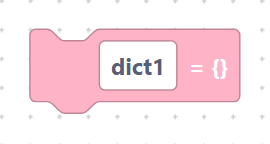
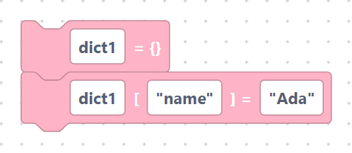
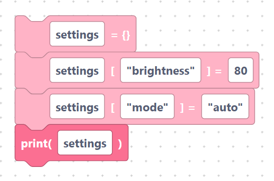

# Creating dictionaries

The `createDict` block makes a new, empty dictionary ready for you to fill.

## The `createDict` block

- **Label:** `%1 = {}`
- **Input:** `var_name` (default `dict1`).

```python
dict1 = {}
```

> {width=inherit}

This creates an empty dictionary. Add entries to it with the blocks on the next
page.

## Keys and values

A dictionary entry has two parts:

- a **key** — the label you look things up by (often a string like `"name"`),
- a **value** — what is stored under that key.

Remember that the key and value fields are inserted **verbatim**, so quote any
literal text:

```python
dict1 = {}
dict1["name"] = "Ada"
```

> {width=inherit}

## Worked example

```python
settings = {}
settings["brightness"] = 80
settings["mode"] = "auto"
print(settings)
```

> {width=inherit}

## Next

Continue to [Set / get / pop / update / clear](crud.md)
