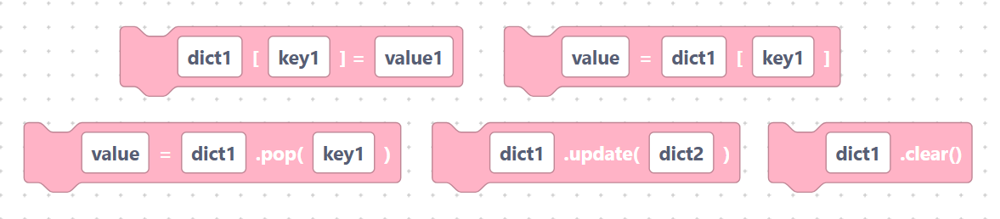
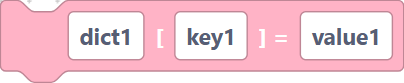
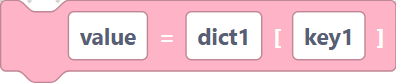
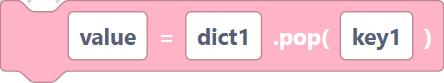
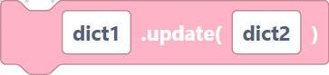
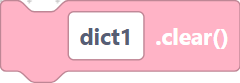
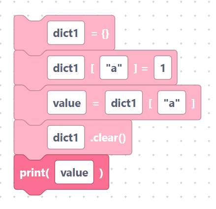

# Set / get / pop / update / clear

> {width=inherit}

These blocks change what is stored in a dictionary or read values back out.

Key and value fields are inserted **verbatim** — quote any literal text.

## The `dictSet` block

- **Label:** `%1[%2] = %3` — inputs `dict_name` (default `dict1`), `key`
  (default `key1`), `value` (default `value1`). Stores a value under a key.

```python
dict1[key1] = value1
```

> {width=inherit}

## The `dictGet` block

- **Label:** `%1 = %2[%3]` — inputs `var_name` (default `value`), `dict_name`
  (default `dict1`), `key` (default `key1`). Reads the value for a key.

```python
value = dict1[key1]
```

> {width=inherit}

## The `dictPop` block

- **Label:** `%1 = %2.pop(%3)` — inputs `var_name` (default `value`), `dict_name`
  (default `dict1`), `key` (default `key1`). Removes a key and returns its value.

```python
value = dict1.pop(key1)
```

> {width=inherit}

## The `dictUpdate` block

- **Label:** `%1.update(%2)` — inputs `dict_name` (default `dict1`),
  `other_dict` (default `dict2`). Merges another dictionary in.

```python
dict1.update(dict2)
```

> {width=inherit}

## The `dictClear` block

- **Label:** `%1.clear()` — input `dict_name` (default `dict1`). Empties the
  dictionary.

```python
dict1.clear()
```

> {width=inherit}

## Worked example

```python
dict1 = {}
dict1["a"] = 1
value = dict1["a"]
dict1.clear()
print(value)
```

> {width=inherit}

## Next

Continue to [`keys`, `values`, `items`](iterate.md)
