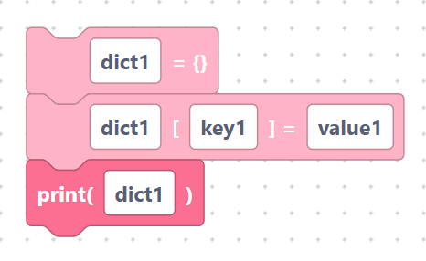

# Dictionary

> {width=inherit}

A **dictionary** stores values by a **key** instead of by position — like a
labelled set of boxes. For example `{"temp": 21, "humidity": 60}` looks up `21`
with the key `"temp"`. The Dictionary category has blocks for building and using
them.

These are mostly **statement blocks** that act on a dictionary you have named.

## What you will learn

- [Creating dictionaries](create.md)
- [Set / get / pop / update / clear](crud.md)
- [`keys`, `values`, `items`](iterate.md)

## A quick taste

```python
dict1 = {}
dict1[key1] = value1
print(dict1)
```

> {width=inherit}

## Next

Continue to [Creating dictionaries](create.md)
