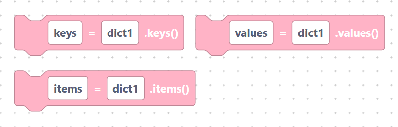
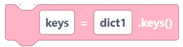
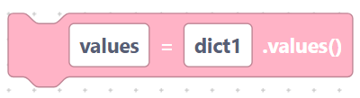
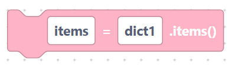
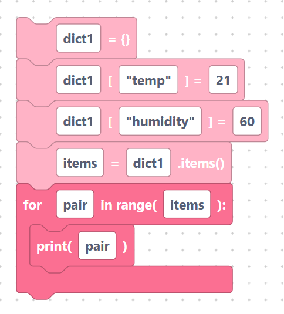

# `keys`, `values`, `items`

> {width=inherit}

These blocks let you look at everything in a dictionary at once — all the keys,
all the values, or both together. Each is a **statement block** that stores the
result in a variable.

## The `dictKeys` block

- **Label:** `%1 = %2.keys()` — inputs `var_name` (default `keys`), `dict_name`
  (default `dict1`). Collects all the keys.

```python
keys = dict1.keys()
```

> {width=inherit}

## The `dictValues` block

- **Label:** `%1 = %2.values()` — inputs `var_name` (default `values`),
  `dict_name` (default `dict1`). Collects all the values.

```python
values = dict1.values()
```

> {width=inherit}

## The `dictItems` block

- **Label:** `%1 = %2.items()` — inputs `var_name` (default `items`), `dict_name`
  (default `dict1`). Collects key–value pairs.

```python
items = dict1.items()
```

> {width=inherit}

## Worked example

Pair these with a [`for` loop](../language/for-loop.md) to visit every entry:

```python
dict1 = {}
dict1["temp"] = 21
dict1["humidity"] = 60
items = dict1.items()
for pair in items:
	print(pair)
```

> {width=inherit}

## Next

Continue to [Random](../random/index.md)
