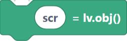
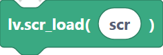
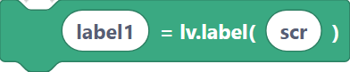
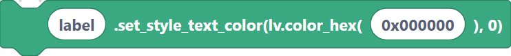
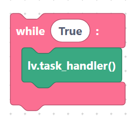

# LVGL concepts (screens, objects, styles, events)

Before wiring up widgets, it helps to understand the few ideas that LVGL is built on.
Every LVGL block you use maps onto one of these concepts.

## Objects

Everything on screen is an **object** (`lv.obj`). A plain `lv.obj()` is a blank
rectangle you can use as a screen or a container. Widgets like labels, buttons, and
sliders are specialized objects. Every object has a **parent** — it is drawn inside
that parent and moves with it.

```python
scr = lv.obj()
```

> {width=inherit}

## Screens

A **screen** is a top-level object with no parent. You build your UI on a screen, then
make it visible with `lv.scr_load(...)`. Only one screen is active at a time, which
makes it easy to switch between "pages" of a UI.

```python
lv.scr_load(scr)
```

> {width=inherit}

## Widgets

Widgets are created by passing a **parent** so LVGL knows where to place them:

```python
label1 = lv.label(scr)
```

> {width=inherit}

## Styles

You change how an object looks with `set_style_*` methods — background colour, text
colour, radius, padding, borders, and shadows. Most style blocks take the value plus a
final `0` (the default style state):

```python
label.set_style_text_color(lv.color_hex(0x000000), 0)
```

> {width=inherit}

## Events

Widgets fire **events** (clicked, value changed…). You react by attaching a callback
with `add_event_cb`. See [Events](events.md) for details.

## The task handler loop

LVGL does not draw on its own. You must call `lv.task_handler()` repeatedly (usually in
a `while True:` loop, or via a `TaskHandler`) so it can render and process input. Without
it, the screen stays blank.

```python
while True:
    lv.task_handler()
```

> {width=inherit}

## Next

Continue to [Initialization: `lvglInit`, LCD bus, framebuffer](init.md).
