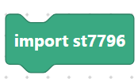
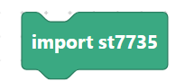
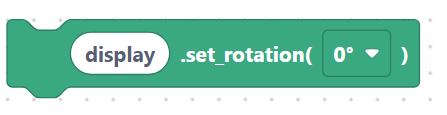

# Drivers: ST7796, ST7735, generic `displayInit`

A **display driver** turns the LCD bus and framebuffers into a usable `display` object
that LVGL can draw on. SemiBlock ships blocks for two common TFT controllers — ST7796
and ST7735 — plus generic blocks to initialize and configure whatever driver you used.

> Requires **`lv_micropython`** firmware with the matching driver module
> (`st7796`, `st7735`, …) built in.

## `importSt7796` / `importSt7735`

Import the driver module.

```python
import st7796
```

> {width=inherit}

```python
import st7735
```

> {width=inherit}

## `st7796Init` — create an ST7796 display

Builds the driver from a data bus, dimensions, control pins, and two frame buffers.

**Inputs:** var name, data bus, width, height, backlight pin, reset pin, frame buffer 1, frame buffer 2.

```python
display = st7796.ST7796(data_bus=display_bus, display_width=320, display_height=480, backlight_pin=6, reset_pin=5, backlight_on_state=st7796.STATE_HIGH, color_space=lv.COLOR_FORMAT.RGB565, color_byte_order=st7796.BYTE_ORDER_BGR, rgb565_byte_swap=True, offset_x=0, offset_y=0, frame_buffer1=fb1, frame_buffer2=fb2)
```

## `st7735Init` — create an ST7735 display

**Inputs:** var name, data bus, width, height, backlight pin, reset pin, offset x, offset y.

```python
display = st7735.ST7735(data_bus=display_bus, display_width=128, display_height=160, backlight_pin=6, reset_pin=5, reset_state=st7735.STATE_LOW, backlight_on_state=st7735.STATE_HIGH, color_space=lv.COLOR_FORMAT.RGB565, color_byte_order=st7735.BYTE_ORDER_BGR, rgb565_byte_swap=True, offset_x=0, offset_y=0)
```

## Generic display configuration

These work with any driver object you created above.

### `displayInit`

```python
display.init()
```

> {width=inherit}

### `displayInitWithType`

**Inputs:** display, display type.

```python
display.init(lv.COLOR_FORMAT.RGB565)
```

### `displaySetRotation`

```python
display.set_rotation(0)
```

> {width=inherit}

### `displaySetColorInversion`

```python
display.set_color_inversion(True)
```

> {width=inherit}

### `displaySetBacklight`

```python
display.set_backlight(100)
```

> {width=inherit}

## Next

Continue to [Task handler, FS driver, scrollbar mode](task-fs.md).
