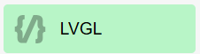
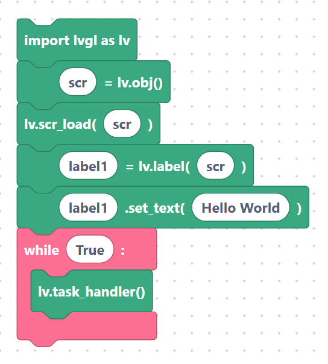

# LVGL (Light & Versatile Graphics Library)

> {width=inherit}

**LVGL** is a full-colour graphics library for building real user interfaces — buttons,
sliders, charts, animations — on a TFT screen. SemiBlock exposes LVGL through
`import lvgl as lv` and a large family of blocks.

> **Firmware requirement:** LVGL blocks only run on **`lv_micropython`** firmware,
> a special MicroPython build that bundles the `lvgl` module (and on some boards
> `lcd_bus`, `task_handler`, and display drivers like `st7796` / `axs15231b`).
> Standard MicroPython does **not** include LVGL.

## How an LVGL program is shaped

1. **Initialize** LVGL and the display driver (or use a board block like Waveshare 3.5").
2. **Create a screen** and load it.
3. **Add widgets** (labels, buttons, sliders…) onto the screen.
4. **Style and position** the widgets.
5. **Run the task handler** in a loop so LVGL can redraw and handle input.

## Minimal example

This is the smallest LVGL program: init, a screen, a label, and the redraw loop.

```python
import lvgl as lv
scr = lv.obj()
lv.scr_load(scr)
label1 = lv.label(scr)
label1.set_text("Hello LVGL")
while True:
    lv.task_handler()
```

> {width=inherit}

On a real board you also need a display driver and a `TaskHandler` (see
[Drivers](drivers.md) and [Task handler, FS driver, scrollbar mode](task-fs.md)).

## All LVGL pages

- [LVGL concepts (screens, objects, styles, events)](concepts.md)
- [Initialization: `lvglInit`, LCD bus, framebuffer](init.md)
- [Drivers: ST7796, ST7735, generic `displayInit`](drivers.md)
- [Task handler, FS driver, scrollbar mode](task-fs.md)
- [Screens: create, load, active, `refrNow`](screens.md)
- [Widgets — Labels & Buttons](widgets-basic.md)
- [Widgets — Container, Slider, Bar, Arc, Spinner](widgets-indicators.md)
- [Widgets — Checkbox, Switch, Textarea, Dropdown, Roller](widgets-input.md)
- [Widgets — Image, LED, Keyboard, Tabview](widgets-media.md)
- [Widgets — Chart, Meter, Canvas](widgets-data.md)
- [Positioning & sizing: `setPos`, `setSize`, `align`](layout.md)
- [Styling: colors, opacity, font, radius, padding, border, shadow](styles.md)
- [Events: `addEventCb`](events.md)
- [Animation: create, init, `setVar`, `setTime`, `setValues`, start](animation.md)
- [Flags: `addFlag`, `clearFlag`, `removeFlag`](flags.md)
- [Cleanup: `objDelete`, `objClean`, `objInvalidate`](cleanup.md)
- [Tick: `lvglTickInc`](tick.md)

## Next

Continue to [LVGL concepts (screens, objects, styles, events)](concepts.md).
