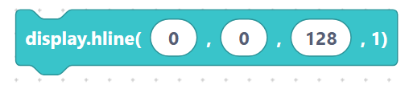
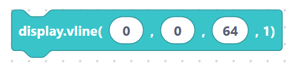
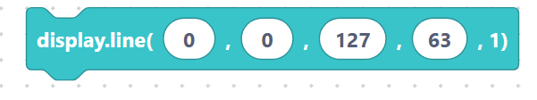
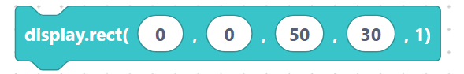
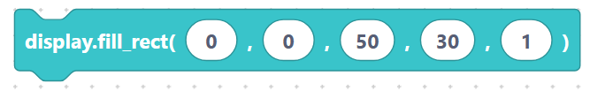
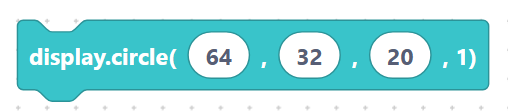
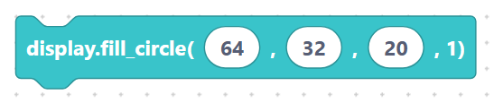
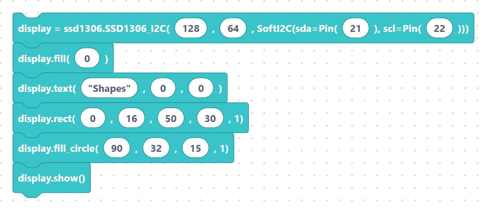

# Text, pixels, lines, rectangles, circles

These blocks draw onto the SSD1306 buffer. They change pixels in memory only —
remember to call `display.show()` afterwards to make them appear. In monochrome mode
the last argument `1` means "pixel on".

## `ssd1306_text` — draw text

**Inputs:** text, x, y. The text field already includes its own quotes.

```python
display.text("Helloworld", 0, 0)
```

> {width=inherit}

## `ssd1306_pixel` — one pixel

**Inputs:** x, y. Always drawn with colour `1`.

```python
display.pixel(0, 0, 1)
```

> {width=inherit}

## `ssd1306_hline` — horizontal line

**Inputs:** x, y, width.

```python
display.hline(0, 0, 128, 1)
```

> {width=inherit}

## `ssd1306_vline` — vertical line

**Inputs:** x, y, width (length).

```python
display.vline(0, 0, 64, 1)
```

> {width=inherit}

## `ssd1306_line` — line between two points

**Inputs:** x1, y1, x2, y2.

```python
display.line(0, 0, 127, 63, 1)
```

> {width=inherit}

## `ssd1306_rect` — rectangle outline

**Inputs:** x, y, width, height.

```python
display.rect(0, 0, 50, 30, 1)
```

> {width=inherit}

## `ssd1306_fillRect` — filled rectangle

**Inputs:** x, y, width, height, color. The colour is passed straight through.

```python
display.fill_rect(0, 0, 50, 30, 1)
```

> {width=inherit}

## `ssd1306_circle` — circle outline

**Inputs:** x (centre), y (centre), radius.

```python
display.circle(64, 32, 20, 1)
```

> {width=inherit}

## `ssd1306_fillCircle` — filled circle

**Inputs:** x, y, radius.

```python
display.fill_circle(64, 32, 20, 1)
```

> {width=inherit}

## Complete example

```python
display = ssd1306.SSD1306_I2C(128, 64, SoftI2C(sda=Pin(21), scl=Pin(22)))
display.fill(0)
display.text("Shapes", 0, 0)
display.rect(0, 16, 50, 30, 1)
display.fill_circle(90, 32, 15, 1)
display.show()
```

> {width=inherit}

## Next

Continue to [`scroll`, `setColor`, `setFontSize`](effects.md).
