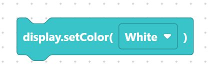
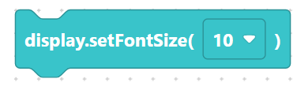
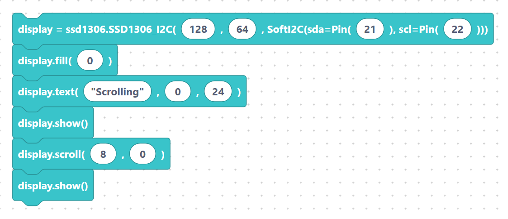

# `scroll`, `setColor`, `setFontSize`

These three blocks add motion and styling on top of the basic drawing primitives.
As always, call `display.show()` to see the result.

## `ssd1306_scroll` — shift the buffer

Moves everything already in the buffer by `x` pixels horizontally and `y` pixels
vertically. Positive values move right/down; negative values move left/up. Combine it
with a loop to make a marquee effect.

**Inputs:** x, y.

```python
display.scroll(10, 0)
```

> {width=inherit}

## `ssd1306_setColor` — set the draw colour

Sets the colour used by following draw calls. The colour name is passed as a string.

**Inputs:** color (text).

```python
display.set_color("white")
```

> {width=inherit}

## `ssd1306_setFontSize` — set the text size

Sets the font size used by following `text` calls. The size is passed as a string.

**Inputs:** fontSize (text).

```python
display.setFontSize("10")
```

> {width=inherit}

## Scrolling example

This draws text, then nudges it across the screen one step at a time.

```python
display = ssd1306.SSD1306_I2C(128, 64, SoftI2C(sda=Pin(21), scl=Pin(22)))
display.fill(0)
display.text("Scrolling", 0, 24)
display.show()
display.scroll(8, 0)
display.show()
```

> {width=inherit}

> `set_color` and `setFontSize` are extensions provided by SemiBlock's `ssd1306`
> build. If your firmware uses the plain `ssd1306` driver, stick to monochrome
> drawing and the default font.

## Next

Continue to [Image Editor block: drawing bitmaps inside SemiBlock](image-editor.md).
