# SSD1306 OLED

The SSD1306 is a small monochrome OLED screen, usually **128×64** pixels, connected
over **I2C**. SemiBlock talks to it through the `ssd1306` driver, which gives every
block a global `display` object you draw onto.

Drawing happens in two steps: you change pixels in memory (text, lines, shapes),
then call **`display.show()`** to push them to the glass. Nothing appears until you
call `show`.

## Block list

All blocks emit `display.<method>(...)` and run on standard MicroPython firmware.

- `ssd1306` — create the display over I2C

> 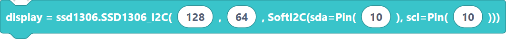{width=inherit}

- `ssd1306_fill` — fill the whole screen
  
> 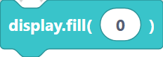{width=inherit}

- `ssd1306_show` — push the buffer to the screen

> 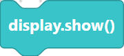{width=inherit}

- `ssd1306_contrast` — set brightness

> 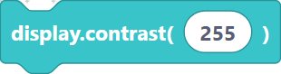{width=inherit}

- `ssd1306_invert` — invert colours

> 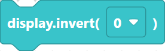{width=inherit}

- `ssd1306_rotate` — rotate the image

> 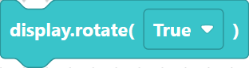{width=inherit}

- `ssd1306_text` — draw text

> 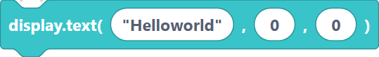{width=inherit}

- `ssd1306_pixel` — set one pixel

> 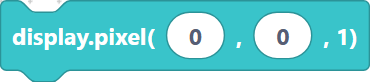{width=inherit}

- `ssd1306_hline` / `ssd1306_vline` — horizontal / vertical line

> 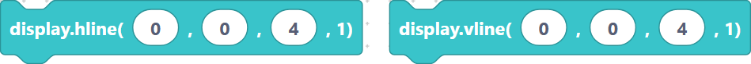{width=inherit}

- `ssd1306_line` — line between two points

> 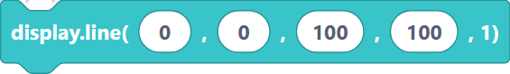{width=inherit}

- `ssd1306_rect` / `ssd1306_fillRect` — rectangle outline / filled

> 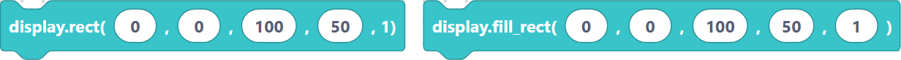{width=inherit}

- `ssd1306_circle` / `ssd1306_fillCircle` — circle outline / filled

> 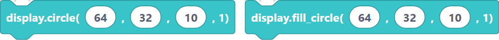{width=inherit}

- `ssd1306_scroll` — shift the buffer

> 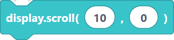{width=inherit}

- `ssd1306_setColor` — set the draw colour

> 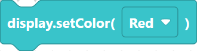{width=inherit}

- `ssd1306_setFontSize` — set the text size

> 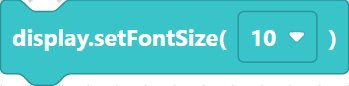{width=inherit}

- `imageEditor` — paint a 128×64 bitmap inside SemiBlock
- `drawPixels` — draw every pixel from an image array

## Hello, world

This complete program initializes the screen over I2C, prints text, and shows it.

```python
display = ssd1306.SSD1306_I2C(128, 64, SoftI2C(sda=Pin(21), scl=Pin(22)))
display.fill(0)
display.text("Helloworld", 0, 0)
display.show()
```

> 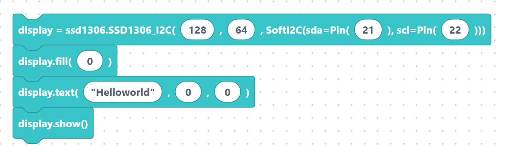{width=inherit}

`import ssd1306` is added automatically by SemiBlock when an SSD1306 block is present.

## Pages

- [`init`, `fill`, `show`, `contrast`, `invert`, `rotate`](setup.md)
- [Text, pixels, lines, rectangles, circles](draw.md)
- [`scroll`, `setColor`, `setFontSize`](effects.md)
- [Image Editor block: drawing bitmaps inside SemiBlock](image-editor.md)
- [`drawPixels`](draw-pixels.md)

## Next

Continue to [`init`, `fill`, `show`, `contrast`, `invert`, `rotate`](setup.md).
