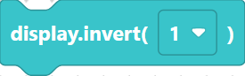
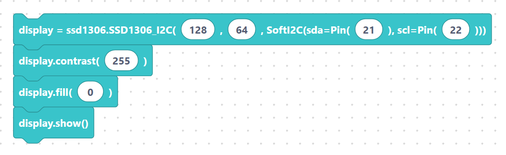

# `init`, `fill`, `show`, `contrast`, `invert`, `rotate`

These blocks create the SSD1306 display and control the whole screen. Get into the
habit of calling **`show`** after any drawing — it is what actually updates the OLED.

## `ssd1306` — create the display

Creates the global `display` object over a software I2C bus.

**Inputs:** width, height, `sda` pin, `scl` pin.

```python
display = ssd1306.SSD1306_I2C(128, 64, SoftI2C(sda=Pin(21), scl=Pin(22)))
```

> {width=inherit}

The block defaults to width `128`, height `64`. Set `sda`/`scl` to match your wiring
(common ESP32 I2C pins are 21 and 22).

## `ssd1306_fill` — fill the screen

Fills the entire buffer with `0` (black/off) or `1` (white/on). Use it to clear the
screen before redrawing.

**Inputs:** number (`0` or `1`).

```python
display.fill(0)
```

> {width=inherit}

## `ssd1306_show` — push to the screen

Sends the in-memory buffer to the OLED. Nothing is visible until you call this.

```python
display.show()
```

> {width=inherit}

## `ssd1306_contrast` — brightness

**Inputs:** value (`0`–`255`).

```python
display.contrast(255)
```

> {width=inherit}

## `ssd1306_invert` — invert colours

Swaps on/off pixels. **Inputs:** dropdown `0` or `1`.

```python
display.invert(1)
```

> {width=inherit}

## `ssd1306_rotate` — rotate

Rotates the image 180°. **Inputs:** dropdown `True` or `False`.

```python
display.rotate(True)
```

> {width=inherit}

## Putting it together

```python
display = ssd1306.SSD1306_I2C(128, 64, SoftI2C(sda=Pin(21), scl=Pin(22)))
display.contrast(200)
display.fill(0)
display.show()
```

> {width=inherit}

## Next

Continue to [Text, pixels, lines, rectangles, circles](draw.md).
