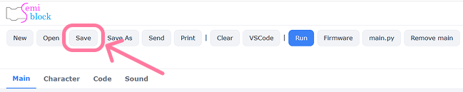
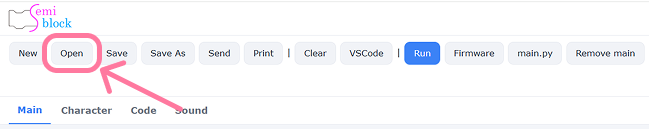
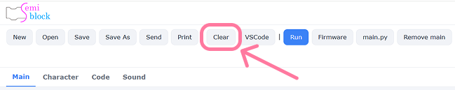

# Save / Open / Clear

Projects grow over time, so SemiBlock lets you **save** your blocks, **open** them back later, and **clear** the workspace to start fresh. These three buttonssit along the top of the editor.

## What gets saved

SemiBlock saves the **blocks themselves** — their types, positions, and fieldvalues — not just the generated code. That means when you load a project, the visual layout returns exactly as you left it, and the code regenerates from it.

Under the hood, SemiBlock uses Blockly's standard serialization to turn your workspace into a JSON snapshot.

## The Save button

> {width=100%}

Clicking **Save** stores your current workspace. SemiBlock writes the snapshot to your browser's **local storage**, so it persists between sessions on the same computer and browser.

```text
[ Save ]  ->  workspace blocks captured as JSON  ->  saved in local storage
```

Because it uses local storage, your saved project stays on **your machine** — nothing is uploaded to a server.

## The open button

> {width=100%}

Clicking **open** restores a previously saved snapshot back into the workspace.
SemiBlock rebuilds every block from the saved JSON, and the code pane refills automatically.

> Loading disables block events while it rebuilds, then re-enables them — so the restore happens cleanly without triggering a flurry of change events.

## The Clear button

> {width=100%}

Clicking **Clear** empties the workspace. Use it when you want a blank canvas for a new idea.

> **Clear removes the blocks on screen.** Save first if you might want them back.

## A typical workflow

1. Build some blocks.
2. Press **Save** to capture your progress.
3. Experiment freely.
4. If an experiment goes wrong, press **open** to return to the saved version.
5. Press **Clear** when you're ready to start something new.

## Important notes

- Saving uses **browser local storage**, so a different browser or computer won't see the same saved project.
- Clearing your browser data also clears saved SemiBlock projects.
- For long-term backups, copy the generated MicroPython into a `.py` file you keep yourself.

## Try it yourself

Build the blink program, press **Save**, then press **Clear** to empty the canvas. Now press **Open** — your blocks should reappear exactly as before, and the code pane should show the blink program again.

## Next

[Built-in simulator](simulator.md)
