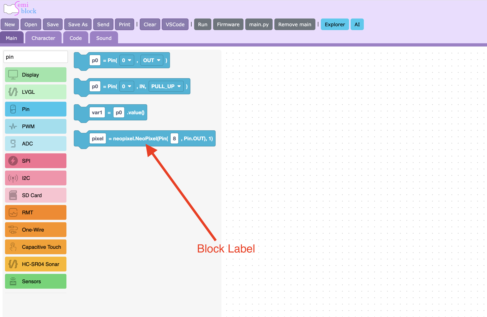

The **toolbox** is the vertical list of categories on the left edge of the editor. Click a category and a *flyout* of blocks slides out; drag a block onto the workspace to use it. This page tours the toolbox so you know where things live.

## How dragging works

1. Click a category name to open its flyout.
2. Press and hold a block, then drag it onto the canvas.
3. Move blocks near each other — matching connectors **snap** together with a click.
4. To delete a block, drag it back over the toolbox (it turns into a trash area).

{width=100%}

## How the toolbox is organized

SemiBlock groups categories with labeled **separators** so related blocks sit together. From top to bottom you'll find three big sections.

### Top: board & simulator setup

Before the first separator are categories for getting started and for the built-in simulator:

- **Machine** — `createMainMethod`, reset, `sleep`, Wi-Fi, CPU frequency, timing.
- **Motion**, **Looks**, **Events** — sprite blocks used by the [simulator](simulator.md).
- **Waveshare 3.5"** — setup for that specific display board.

### Python

After the **Python** separator come the language and data blocks — these generate ordinary MicroPython:

- **Language** — loops, `if`/`elif`/`else`, `print`, variables, `def`, threads.
- **List**, **Dictionary** — collections.
- **Math**, **String**, **Random** — calculations and text.
- **Exception**, **Regex**, **Requests** — error handling, pattern matching, HTTP.
- **SemiBlock IoT**, **CSV**, **OS**, **Display**, **LVGL** — storage, files, and screens.

### Hardware Blocks

After the **Hardware Blocks** separator are categories that talk to the chip's peripherals:

{width=100%}

#### **Pin** (digital I/O, UART, NeoPixel)

> {width=inherit border-radius: 50}

#### **Timer**, **PWM**, **ADC** (timing and analog signals)

> {width=inherit}
> {width=inherit}
> {width=inherit}

#### **SPI**, **I2C**, **One-Wire** (communication buses)

> {width=inherit} 
> {width=inherit} 
> {width=inherit}

#### **WatchDog**, **SD Card**, **RMT**, **Capacitive**, **DHT**, **HC-SR04 Sonar** (sensors and utilities)

> {width=inherit} 
> {width=inherit} 
> {width=inherit}

### Sensor & AI Blocks

After the **Sensor & AI Blocks** separator:

{width=100%}

#### **Sensors** (temperature, 4-digit display, motor, servo)

> {width=inherit}

#### **Generative AI** (askDeepSeek)

> {width=inherit}

#### **Open Data** (weather, holidays, bus and flight info)

> {width=inherit}

## Reading a block's label

Every block shows a human-readable label. Hardware blocks often mirror the code they create. For example the Pin block reads `%1 = Pin(%2, %3)` and produces:

| Block | Code (Python) |
| ---   | ---           |
| | `led = Pin(2, Pin.OUT)` |

{width=100%}

The blanks (`%1`, `%2`, `%3`) are the fields you fill in on the block.

## Try it yourself

Open the **Hardware Blocks → Pin** category and the **Language** category. Drag one block from each onto the workspace, then drag them apart again to feel how snapping works.

## Next

[Generating MicroPython code](generate-code.md)
