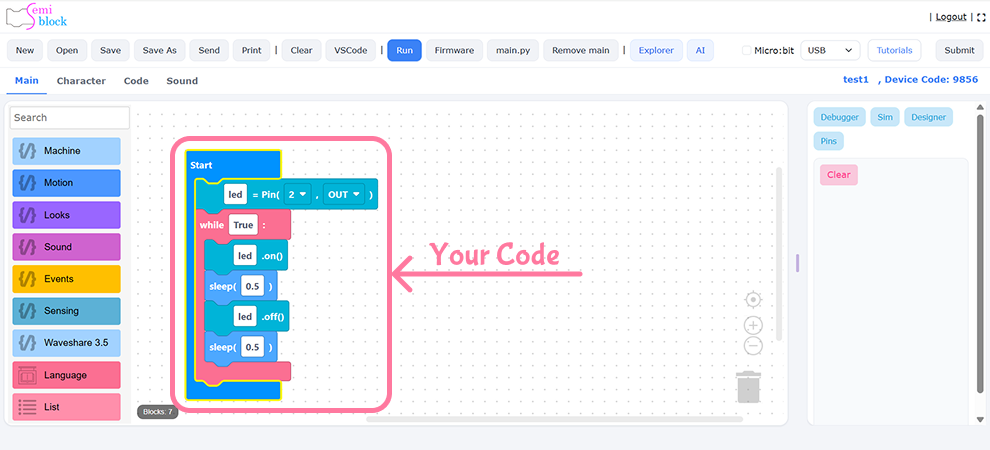
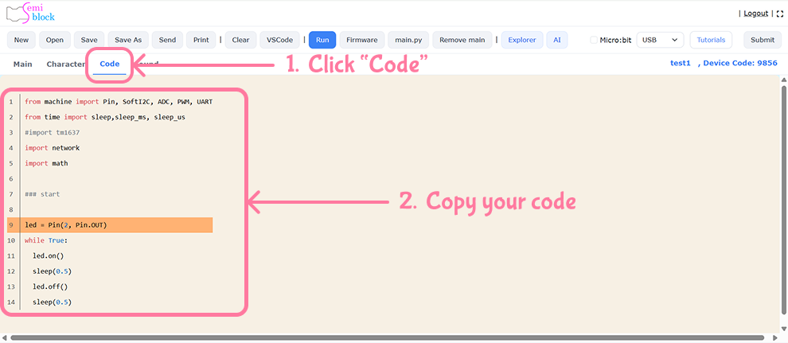

# Uploading and running on the board

You've built blocks and generated MicroPython. Now let's get that code onto your
ESP32 and watch it run. Uploading copies your program to the board's flash
storage so MicroPython can execute it.

## How MicroPython runs your code

MicroPython looks for two special files on the board:

- **`boot.py`** — runs first, for one-time setup.
- **`main.py`** — runs right after boot, every time the board powers on.

To make your program run automatically, save the generated code as **`main.py`**
on the board.

## Step 1 — Copy the generated code

{width=100%}

{width=100%}

In the editor, select the text in the **Generated MicroPython** pane and copy it.
For the blink example that's:

```python
from machine import Pin
from time import sleep

led = Pin(2, Pin.OUT)

while True:
    led.on()
    sleep(0.5)
    led.off()
    sleep(0.5)
```

Paste it into a file named `main.py` on your computer.

## Step 2 — Upload `main.py` to the board

Use a MicroPython transfer tool over the serial port. Two common choices:

### Using `mpremote`

```bash
mpremote connect /dev/ttyUSB0 fs cp main.py :main.py
```

Replace `/dev/ttyUSB0` with your port (`/dev/cu.usbserial-0001` on macOS, `COM5`
on Windows).

### Using `ampy`

```bash
ampy --port /dev/ttyUSB0 put main.py
```

## Step 3 — Run it

The board runs `main.py` automatically after a reset. Trigger a reset by:

- Pressing the **RESET/EN** button on the board, **or**
- Re-opening the serial connection.

Your LED should now blink on and off every half second.

## Watching output and stopping the program

Open the REPL to see `print()` output or to stop a running loop:

```bash
mpremote connect /dev/ttyUSB0
```

- Press **Ctrl-C** to interrupt the running program and get a `>>>` prompt.
- Press **Ctrl-D** to soft-reset and run `main.py` again.

## Running once without auto-start

To test code *without* saving it as `main.py`, run a file directly:

```bash
mpremote connect /dev/ttyUSB0 run main.py
```

This executes the file once but doesn't store it — great for quick experiments.

## Troubleshooting

- **Nothing happens** → confirm the file is named exactly `main.py`.
- **LED never lights** → check the pin number matches your board's LED.
- **Port busy** → close other serial tools (only one program can hold the port).

## Try it yourself

Upload the blink program, confirm it runs, then change `sleep(0.5)` to
`sleep(0.1)`, re-upload, and reset. The faster blink proves your edit reached the
board.

> {width=inherit}

## Next

[Editor Walkthrough](editor-tour.md)
