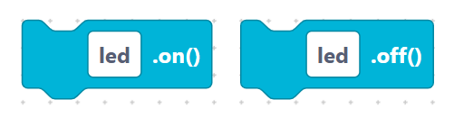
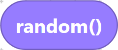
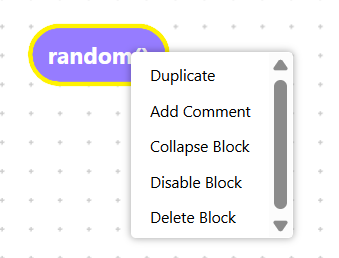

# Workspace, toolbox, and code pane

The SemiBlock editor has three parts you'll use constantly: the **toolbox** (where
blocks come from), the **workspace** (where you build), and the **code pane**
(where MicroPython appears). This page looks at each in a little more depth.

## The toolbox

The toolbox is the categorized menu of blocks. Clicking a category opens a
*flyout* you can drag from.

- Categories are grouped by labeled separators: **Python**, **Hardware Blocks**,
  and **Sensor & AI Blocks**.
- Each category has a color so related blocks are easy to spot — for example the
  **Pin** category is a light blue.

> {width=inherit}

- Drag a block out of the flyout to add it; drag a block back over the toolbox to
  delete it.

## The workspace

The workspace is the main canvas where your program takes shape.

### Moving around

- **Pan** — drag empty canvas space.
- **Zoom** — mouse wheel or trackpad pinch.
- **Select** — click a block; **Shift-click** to add more.

### Connecting blocks

Blocks have shaped connectors:

- **Statement** blocks stack vertically (top-to-bottom flow).
- **Value** blocks plug into the notches of other blocks (inputs).

#### **Statement Blocks** feature a **Rectangular Puzzle Shape**.

> {width=inherit}

#### **Value Blocks** feature a **Rounded Pill Shape**.

> {width=inherit}

When two compatible connectors get close, they highlight and snap together.

### Block menus

Right-click any block for handy actions: **Duplicate**, **Add Comment**,
**Collapse**, **Disable**, and **Delete**.

> {width=inherit}

## The code pane

The left pane shows the generated MicroPython and refreshes the instant your
blocks change. It is read-only by design — your blocks are the source of truth.

```python
from machine import Pin
from time import sleep

led = Pin(2, Pin.OUT)
while True:
    led.on()
    sleep(0.5)
    led.off()
    sleep(0.5)
```

If a line looks wrong, fix the block that produced it — then watch the line
correct itself.

## How the three parts work together

```text
Toolbox  ──drag──►  Workspace  ──generates──►  Code pane
 (source)            (build)                    (result)
```

You pull blocks from the toolbox, arrange them in the workspace, and read the
result in the code pane. That loop is the whole editing experience.

## Try it yourself

Open the **Pin** category, drag in a Pin block, and place it in the workspace.
Then duplicate it with right-click → **Duplicate**. Watch two `Pin(...)` lines
appear in the code pane, then delete one and confirm a line disappears.

## Next

[Save / Load / Clear](save-load.md)
