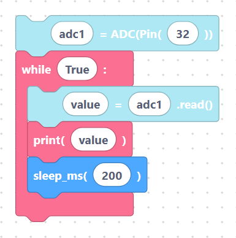

# ADC — read analog values

An **ADC** measures the voltage on a pin and converts it to a number. This lets
you read sensors whose output is a varying voltage, such as a potentiometer
(volume knob), a light-dependent resistor, or a temperature sensor.

## `adcInit` — attach an ADC to a pin

Creates an `ADC` object on a GPIO pin.

**Inputs / parameters**

- **var_name** — variable name for the ADC (default `adc1`).
- **pin_number** — GPIO to read (default `32`).

**Generated MicroPython**

```python
adc1 = ADC(Pin(32))
```

> {width=inherit}

## `adcRead` — read the value

Reads the ADC and stores the result in a variable.

**Inputs / parameters**

- **var_name** — variable that receives the reading (default `value`).
- **adc_name** — the ADC variable to read (default `adc1`).

**Generated MicroPython**

```python
value = adc1.read()
```

> {width=inherit}

## Reading in a loop

```python
adc1 = ADC(Pin(32))
while True:
	value = adc1.read()
	print(value)
	sleep_ms(200)
```

> {width=inherit}

## Wiring notes

- On the ESP32, the ADC pins are the **ADC1** channels: GPIO 32–39 are the most
  reliable for analog input.
- The input range is **0 V to ~3.3 V** — never feed a higher voltage into an
  analog pin. Use a voltage divider if your sensor outputs more (see
  [Powering sensors safely](../power.md)).
- For a potentiometer: outer legs to **3.3 V** and **GND**, middle (wiper) leg
  to the ADC pin.

## Next

Continue to **[DAC — write analog values »](dac.md)**
