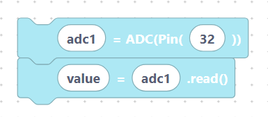

# ADC & DAC

These two peripherals bridge the analog and digital worlds:

- **ADC** (Analog-to-Digital Converter) **reads** a voltage and turns it into a
  number — perfect for potentiometers, light sensors, and other analog inputs.
- **DAC** (Digital-to-Analog Converter) **outputs** a real voltage from a
  number — useful for simple audio or analog control signals.

`ADC` is imported by default; `DAC` lives in the same `machine` module, so add
it when you need it:

```python
from machine import Pin, SoftI2C, ADC, PWM, UART
from machine import DAC
```

## What's in this category

- **[ADC — read analog](adc.md)**
  - `adcInit` — attach an ADC to a pin.
  
> {width=inherit}

  - `adcRead` — read the converted value.

> {width=inherit}

- **[DAC — write analog](dac.md)**
  - `dacInit` — attach a DAC to a pin.

> {width=inherit}

  - `dacWrite` — output a voltage.

> {width=inherit}


## Quick mental model

```python
adc1 = ADC(Pin(32))
value = adc1.read()
```

> {width=inherit}

The ESP32 has two DAC outputs only, on **GPIO 25** and **GPIO 26**.

## Next

Continue to **[ADC — read analog values »](adc.md)**
