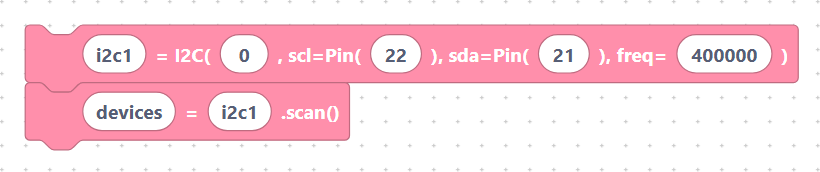

# I²C

> {width=inherit}

**I²C** (Inter-Integrated Circuit) is a popular two-wire bus that lets many
chips share the same pair of wires. It is used by OLED displays, real-time
clocks, accelerometers, and a huge range of sensors. Each device has a unique
**address** so the ESP32 knows who it is talking to.

The two signals are:

- **SDA** — serial data.
- **SCL** — serial clock.

The hardware `I2C` class lives in `machine`. The default imports include
`SoftI2C`; for the hardware bus shown here, add `I2C`:

```python
from machine import I2C
```

## What's in this category

- **[I²C API](api.md)**

  - `i2cInit` — create the bus on SCL/SDA pins.

> {width=inherit}

  - `i2cScan` — list the addresses of connected devices.

> {width=inherit}

  - `i2cRead` — read bytes from a device.

> {width=inherit}

  - `i2cWrite` — write bytes to a device.

> {width=inherit}


## Quick mental model

```python
i2c1 = I2C(0, scl=Pin(22), sda=Pin(21), freq=400000)
devices = i2c1.scan()
```

> {width=inherit}

`scan()` is the friendliest way to check your wiring — it returns a list of the
addresses it finds.

## Next

Continue to **[I²C API »](api.md)**
