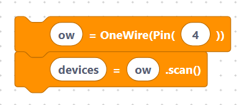

# One-Wire

> {width=inherit}

The **One-Wire** bus needs just a single data wire (plus power and ground) to
talk to one or more devices. Its most famous user is the **DS18B20** digital
temperature sensor. Each One-Wire device has a unique 64-bit ID, so several can
share the same pin.

The `OneWire` class comes from the `onewire` module:

```python
from onewire import OneWire
```

## What's in this category

- **[One-Wire API](api.md)**
  - `oneWireInit` — create the bus on a pin.

> {width=inherit}

  - `oneWireScan` — list the device IDs found.

> {width=inherit}

  - `oneWireRead` — read a byte.

> {width=inherit}

  - `oneWireWrite` — write a byte.

> {width=inherit}


## Quick mental model

```python
ow = OneWire(Pin(4))
devices = ow.scan()
```

> {width=inherit}


`scan()` returns the ID of every device on the wire — a good first test.

## Next

Continue to **[One-Wire API »](api.md)**
