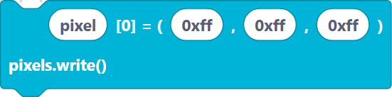

# Pin

> {width=inherit}

The **Pin** category is the foundation of all hardware control. A *pin* (short
for GPIO) is a single electrical connection on your ESP32 that you can switch on
and off, read as an input, or use to talk to other chips.

Everything in this category maps to MicroPython's `machine.Pin` class plus a few
related helpers (`UART` for serial, `neopixel` for addressable LEDs).

## What's in this category

### **[Digital IN / OUT](digital-io.md)** — create a pin as an input or output.

#### `pin` — choose direction `OUT` or `IN`.

> {width=inherit}

#### `pin2` — input pin with an internal `PULL_UP` / `PULL_DOWN` resistor.
  
> {width=inherit}

### **[On / off / read](on-off.md)** — drive a pin and read its state.
#### `on` — set the pin HIGH.

> {width=inherit}

#### `off` — set the pin LOW.

> {width=inherit}

#### `pinValue` — read the current value of a pin.

> {width=inherit}

### **[UART serial](uart.md)** — send and receive bytes over a serial port.

#### `uartInit` — open a UART with baud rate and TX/RX pins.

> {width=inherit}
 
#### `uartRead` — read a number of bytes.

> {width=inherit}

#### `uartWrite` — write a string.

> {width=inherit}

### **[NeoPixel LEDs](neopixel.md)** — drive WS2812 addressable RGB LEDs.

#### `neoPixel` — create a NeoPixel strip object.

> {width=inherit}

#### `neoPixelWrite` — set a colour and push it to the strip.

> {width=inherit}

## Quick mental model

1. **Create** a pin object once (`pin`, `pin2`, `uartInit`, `neoPixel`).
2. **Use** it many times (`on`, `off`, `pinValue`, `uartRead`, etc.).

The "create" blocks assign to a **variable name** you choose (like `led` or
`p0`); the "use" blocks refer back to that same name.

## Next

Continue to **[Digital IN / OUT »](digital-io.md)**
