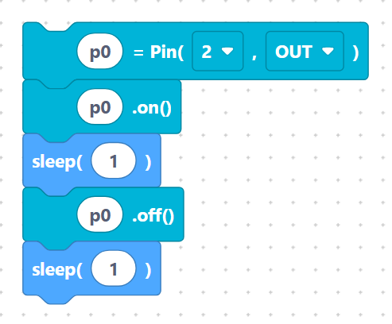

# On / off / read

Once you have created a `Pin` object (see [Digital IN / OUT](digital-io.md)) you
use these three blocks to **drive** an output or **read** an input. They all
refer back to the variable name you gave the pin.

## `on` — set the pin HIGH

Drives an output pin to its HIGH level (3.3 V on the ESP32).

**Inputs / parameters**

- **var_name** — the pin variable to turn on (default `p0`).

**Generated MicroPython**

```python
p0.on()
```

> {width=inherit}

Use this to light an LED, energise a relay, or send a logic HIGH.

## `off` — set the pin LOW

Drives an output pin to its LOW level (0 V / GND).

**Inputs / parameters**

- **var_name** — the pin variable to turn off (default `p0`).

**Generated MicroPython**

```python
p0.off()
```

> {width=inherit}

## `pinValue` — read a pin

Reads the current digital level of a pin and stores it in a variable. The
result is `1` (HIGH) or `0` (LOW).

**Inputs / parameters**

- **var_name** — variable that receives the reading (default `var1`).
- **pin_name** — the pin variable to read (default `p0`).

**Generated MicroPython**

```python
var1=p0.value()
```

> {width=inherit}

## A complete blink

Combining a `pin` (output) with `on`, `off`, and `sleep`:

```python
p0 = Pin(2, Pin.OUT)
p0.on()
sleep(1)
p0.off()
sleep(1)
```

> {width=inherit}

## Wiring notes

- An output pin can supply only a small current — always put a resistor
  (≈330 Ω) in series with an LED.
- For reading a button, create the pin with `pin2` and a `PULL_UP` resistor so
  the input never floats.

## Next

Continue to **[UART serial »](uart.md)**
