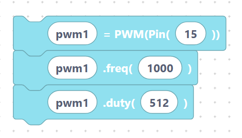

# PWM

> {width=inherit}

**PWM** (Pulse-Width Modulation) switches a pin on and off very quickly. By
changing how long the pin stays on during each cycle (the **duty cycle**) you
control the *average* power delivered. This lets a digital pin dim an LED, set
a motor's speed, or play a tone on a buzzer.

`PWM` is already imported for you at the top of every program:

```python
from machine import Pin, SoftI2C, ADC, PWM, UART
```

## What's in this category

- **[PWM API](api.md)**
  - `pwmInit` — attach PWM to a pin.
  - `pwmSetFreq` — set the switching frequency.
  - `pwmSetDuty` — set the duty cycle (brightness / power).
  - `pwmDeinit` — release the PWM.
- **[Worked example: fade an LED](led-dim.md)** — sweep the duty in a loop.

## Quick mental model

1. **Create** the PWM on a pin with `pwmInit`.
2. **Tune** it with `pwmSetFreq` and `pwmSetDuty`.
3. **Release** it with `pwmDeinit` when finished.

```python
pwm1 = PWM(Pin(15))
pwm1.freq(1000)
pwm1.duty(512)
```

> {width=inherit}

On the ESP32 the duty value ranges from `0` (always off) to `1023` (always on).

## Next

Continue to **[PWM API »](api.md)**
