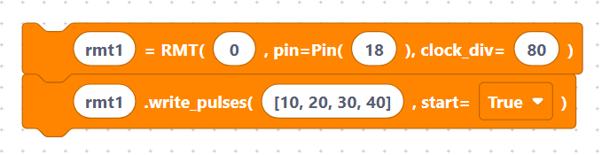

# RMT

The **RMT** (Remote Control) peripheral is an ESP32 feature that generates very
precise pulse trains in hardware. It was originally designed for **infrared
remote controls**, but it is also great for driving WS2812 LEDs and any signal
that needs exact microsecond timing.

The `RMT` class comes from the `esp32` module:

```python
from esp32 import RMT
```

## What's in this category

- **[RMT API](api.md)**
  - `rmtInit` — create an RMT channel on a pin.

> {width=inherit}

  - `rmtWrite` — send a list of pulse durations.

> {width=inherit}

  - `rmtDeinit` — release the channel.

> {width=inherit}


## Quick mental model

```python
rmt1 = RMT(0, pin=Pin(18), clock_div=80)
rmt1.write_pulses([10, 20, 30, 40], start=True)
```

> {width=inherit}

The `clock_div` sets the tick length: with an 80 MHz source, `clock_div=80`
gives a 1 µs tick, so each number in the pulse list is a duration in
microseconds.

## Next

Continue to **[RMT API »](api.md)**
