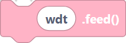
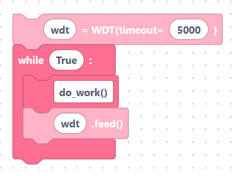

# Watchdog (WDT)

A **watchdog timer** is a safety net. Once started, it expects your program to
"feed" it regularly. If too much time passes without a feed — usually because
the program has frozen — the watchdog **resets the board** so it can recover on
its own.

The `WDT` class comes from `machine`:

```python
from machine import WDT
```

## `wdtInit` — start the watchdog

Creates a `WDT` with a timeout in milliseconds. After this, you must feed it
before the timeout elapses.

**Inputs / parameters**

- **var_name** — variable name (default `wdt`).
- **timeout** — timeout in milliseconds (default `5000`).

**Generated MicroPython**

```python
wdt = WDT(timeout=5000)
```

> {width=inherit}

## `wdtFeed` — keep the board alive

Resets the watchdog's countdown. Call this often inside your main loop.

**Inputs / parameters**

- **wdt_name** — the WDT variable (default `wdt`).

**Generated MicroPython**

```python
wdt.feed()
```

> {width=inherit}

## Typical pattern

```python
wdt = WDT(timeout=5000)
while True:
	do_work()
	wdt.feed()   # must run at least every 5 seconds
```

> {width=inherit}

## Notes

- Once started, the watchdog **cannot be stopped** — plan your feeds carefully.
- If a long operation might exceed the timeout, increase the timeout or feed the
  watchdog partway through.

## Next

Continue to **[Deep Sleep »](deep-sleep.md)**
