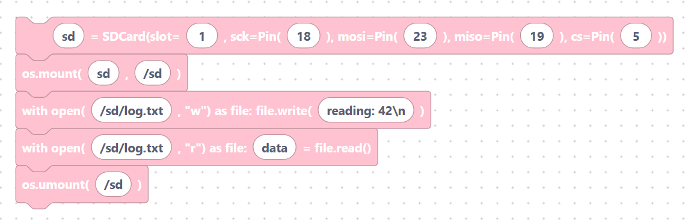

# Reading & Writing SD Card Files

Once the card is mounted under `/sd`, you read and write files with the standard
Python `open()` function. These two blocks wrap the most common patterns.

## `sdCardFileWrite` — write text to a file

Opens a file for writing and writes a string to it. The `with` block closes the
file automatically.

**Inputs / parameters**

- **file_path** — path on the card (default `/sd/file.txt`).
- **data** — text to write (default `Hello, SD card!`).

**Generated MicroPython**

```python
with open("/sd/file.txt", "w") as file:
	file.write("Hello, SD card!")
```

> {width=inherit}


Opening with `"w"` **replaces** the file. Use `"a"` instead to append to the
end — handy for log files.

## `sdCardFileRead` — read text from a file

Opens a file for reading and reads its whole contents into a variable.

**Inputs / parameters**

- **file_path** — path on the card (default `/sd/file.txt`).
- **var_name** — variable for the contents (default `data`).

**Generated MicroPython**

```python
with open("/sd/file.txt", "r") as file:
	data = file.read()
```

> {width=inherit}


## Putting it together

```python
sd = SDCard(slot=1, sck=Pin(18), mosi=Pin(23), miso=Pin(19), cs=Pin(5))
os.mount(sd, "/sd")

with open("/sd/log.txt", "w") as file:
	file.write("reading: 42\n")

with open("/sd/log.txt", "r") as file:
	data = file.read()
print(data)

os.umount("/sd")
```

> {width=inherit}

## Notes

- The folder in the path (for example `/sd`) must match where you mounted the
  card.
- Always close files (the `with` block does this) before unmounting so all data
  is flushed to the card.

## Next

Return to the **[Hardware overview »](../index.md)**
