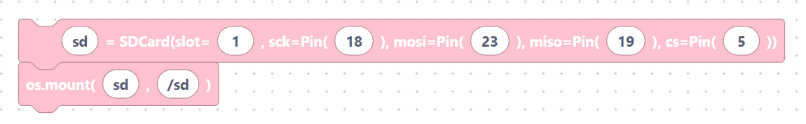

# SD Card

> {width=inherit}

An **SD card** gives your project a large, removable place to store data — logs,
photos, configuration files, and more. The ESP32 talks to the card over SPI,
then **mounts** it into the filesystem so you can open files with the normal
Python `open()` function.

You will use two modules:

```python
from machine import SDCard
import os
```

## What's in this category

- **[Mounting](mount.md)**
  - `sdCardInit` — set up the card on SPI pins.

> {width=inherit}

  - `sdCardMount` — attach it to a folder like `/sd`.

> {width=inherit}

  - `sdCardUnmount` — safely detach it.

> {width=inherit}

- **[Reading & writing files](files.md)**
  - `sdCardFileWrite` — write text to a file.

> {width=inherit}

  - `sdCardFileRead` — read text back.

> {width=inherit}


## Quick mental model

```python
sd = SDCard(slot=1, sck=Pin(18), mosi=Pin(23), miso=Pin(19), cs=Pin(5))
os.mount(sd, "/sd")
```

> {width=inherit}


After mounting, anything under `/sd` lives on the card.

## Next

Continue to **[Mounting »](mount.md)**
