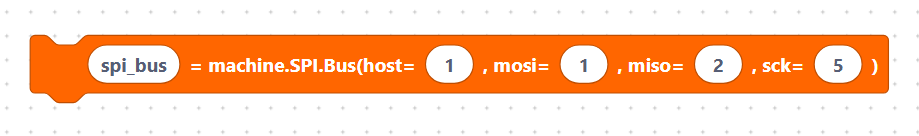
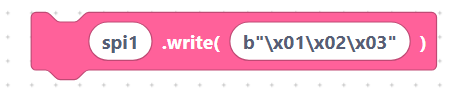

# SPI API

These five blocks set up an SPI bus and move data over it.

## `spiInit` — create an SPI bus

Creates an `SPI` object with an ID, speed, clock mode, and pins.

**Inputs / parameters**

- **var_name** — variable name (default `spi1`).
- **spi_id** — hardware SPI ID (default `1`).
- **baudrate** — clock speed in Hz (default `1000000`).
- **polarity** — clock idle level, `0` or `1`.
- **phase** — sampling edge, `0` or `1`.
- **sck** — clock pin (default `18`).
- **mosi** — data-out pin (default `23`).
- **miso** — data-in pin (default `19`).

**Generated MicroPython**

```python
spi1 = SPI(1, baudrate=1000000, polarity=0, phase=0, sck=Pin(18), mosi=Pin(23), miso=Pin(19))
```

> {width=inherit}

## `spiBusInit` — low-level SPI bus

Creates a `machine.SPI.Bus`, used by some display drivers that manage SPI
themselves.

**Inputs / parameters**

- **var_name** — variable name (default `spi_bus`).
- **host** — SPI host number (default `1`).
- **mosi** — data-out pin (default `1`).
- **miso** — data-in pin (default `2`).
- **sck** — clock pin (default `5`).

**Generated MicroPython**

```python
spi_bus = machine.SPI.Bus(host=1, mosi=1, miso=2, sck=5)
```

> {width=inherit}

## `spiRead` — read bytes

Reads a fixed number of bytes from the bus.

**Inputs / parameters**

- **var_name** — variable for the result (default `data`).
- **spi_name** — the SPI variable (default `spi1`).
- **length** — number of bytes to read (default `10`).

**Generated MicroPython**

```python
data = spi1.read(10)
```

> {width=inherit}

## `spiWrite` — write bytes

Sends a `bytes` object out over MOSI.

**Inputs / parameters**

- **spi_name** — the SPI variable (default `spi1`).
- **data** — the bytes to send (default `b"\x01\x02\x03"`).

**Generated MicroPython**

```python
spi1.write(b"\x01\x02\x03")
```

> {width=inherit}

## `spiReadWrite` — read into a buffer

Reads bytes from the bus into an existing `bytearray`.

**Inputs / parameters**

- **var_name** — variable for the result (default `buffer`).
- **spi_name** — the SPI variable (default `spi1`).
- **buffer** — the buffer to fill (default `bytearray(10)`).

**Generated MicroPython**

```python
buffer = spi1.readinto(bytearray(10))
```

> {width=inherit}

## Wiring notes

- Connect **SCK→SCK**, **MOSI→MOSI**, **MISO→MISO**, and a separate **CS** pin
  per device.
- Every device shares SCK/MOSI/MISO; only its **CS** line is unique.
- Tie all grounds together and match the device's logic voltage (3.3 V).

## Next

Continue to **[I²C overview »](../i2c/index.md)**
