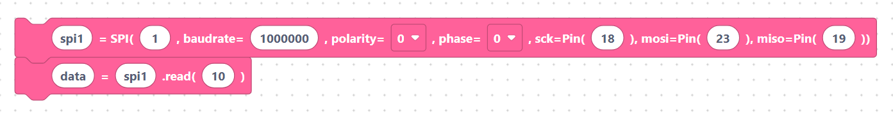

# SPI

> {width=inherit}

**SPI** (Serial Peripheral Interface) is a fast, four-wire bus used by displays,
SD cards, and many high-speed sensors. One device (your ESP32) is the
**controller**; it drives a clock and exchanges data with one or more
peripherals.

The four signals are:

- **SCK** — clock, generated by the controller.
- **MOSI** — Controller Out, Peripheral In (data to the device).
- **MISO** — Controller In, Peripheral Out (data from the device).
- **CS** — chip select (one per device), handled with a normal `Pin`.

`SPI` comes from the `machine` module. Add it (or use `machine.SPI`) when you
need it:

```python
from machine import SPI
```

## What's in this category

- **[SPI API](api.md)**
  - `spiInit` — create an `SPI` bus with pins and speed.
  - `spiBusInit` — low-level `machine.SPI.Bus` helper.
  - `spiRead` — read a number of bytes.
  - `spiWrite` — write bytes.
  - `spiReadWrite` — read into a buffer.

## Quick mental model

```python
spi1 = SPI(1, baudrate=1000000, polarity=0, phase=0, sck=Pin(18), mosi=Pin(23), miso=Pin(19))
data = spi1.read(10)
```

> {width=inherit}

## Next

Continue to **[SPI API »](api.md)**
