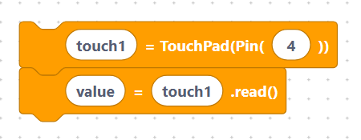

# Capacitive Touch

> {width=inherit}

The ESP32 has built-in **capacitive touch** sensing. Certain pins can detect the
change in capacitance when your finger gets close, so you can build touch
buttons and sliders with nothing more than a wire or a pad of copper tape — no
extra components needed.

The `TouchPad` class comes from `machine`:

```python
from machine import TouchPad
```

## What's in this category

- **[Touch API](api.md)**
  - `touchInit` — attach a touch pad to a pin.

> {width=inherit}

  - `touchRead` — read the current touch value.

> {width=inherit}


## Quick mental model

```python
touch1 = TouchPad(Pin(4))
value = touch1.read()
```

> {width=inherit}


`read()` returns a number that **drops** when the pad is touched. Read it once
untouched to learn the baseline, then treat anything well below that as a press.

## Next

Continue to **[Touch API »](api.md)**
