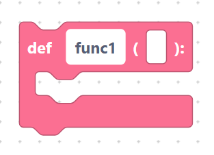
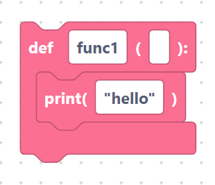
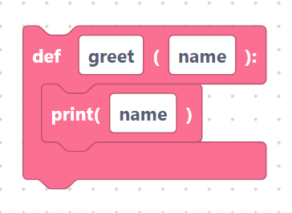
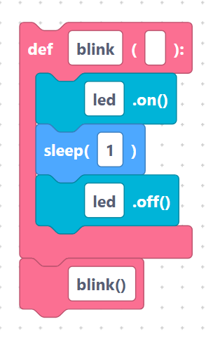

# Defining functions (`def`)

A **function** is a named block of code you can run whenever you need it. Define
it once, then call it many times. The `def` block creates one.

## The `def` block

> {width=inherit}

- **Label:** `def %1(%2):`
- **Inputs:**
  - `funcName` — the function's name (default `func1`).
  - `parameters` — a comma-separated list of inputs (default empty).
- **Body:** the statements that run when the function is called.

With the defaults and a `print` block inside:

```python
def func1():
	print("hello")
```

> {width=inherit}

## Adding parameters

Type one or more parameter names into the `parameters` field, separated by
commas:

```python
def greet(name):
	print(name)
```

> {width=inherit}

Now calling `greet("Ada")` would print `Ada`.

## Calling your function

A `def` block only *defines* the function — it does not run it. Call it with a
[free code](free-code.md) block or by name elsewhere:

```python
def blink():
	led.on()
	sleep(1)
	led.off()

blink()
```

> {width=inherit}

> Tip: define your functions near the top of the workspace so they exist before
> the code that calls them runs.

## Next

Continue to [Threads (`startThread`)](threads.md)
