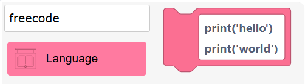
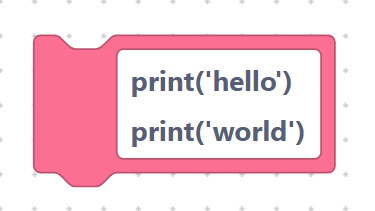
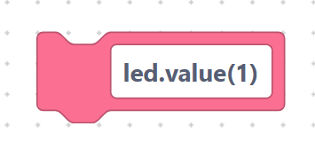
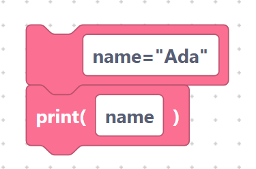

# Free code blocks

Sometimes there is no block for exactly what you need — maybe a brand-new
library or a tricky one-liner. The **free code** block lets you type raw
MicroPython directly, and SemiBlock drops it into your program unchanged.

## The `freeCode` block

> {width=inherit}

- **Label:** a single multi-line text box.
- **Input:** `FIELDNAME` — any MicroPython text you like. It may span several
  lines.

Whatever you type is emitted **exactly as-is**, with no changes at all. The
default contents are two `print` lines:

```python
print('hello')
print('world')
```

> {width=inherit}

If you change the box to read `led.value(1)`, the generated code is simply:

```python
led.value(1)
```

> {width=inherit}

## When to use it

- Calling a library that has no dedicated block yet.
- Writing a short expression faster than snapping blocks together.
- Copying a snippet from MicroPython documentation.

> Tip: free code is powerful but unchecked. SemiBlock will not catch typos for
> you, so read your text carefully.

## Worked example

Combine a free code block with a [`print`](print-comment.md) block:

```python
name = "Ada"
print(name)
```

> {width=inherit}

Here the first line came from a free code block and the second from a `print`
block. Mixing both styles is perfectly normal.

## Next

Continue to [`import` and `from … import`](imports.md)
