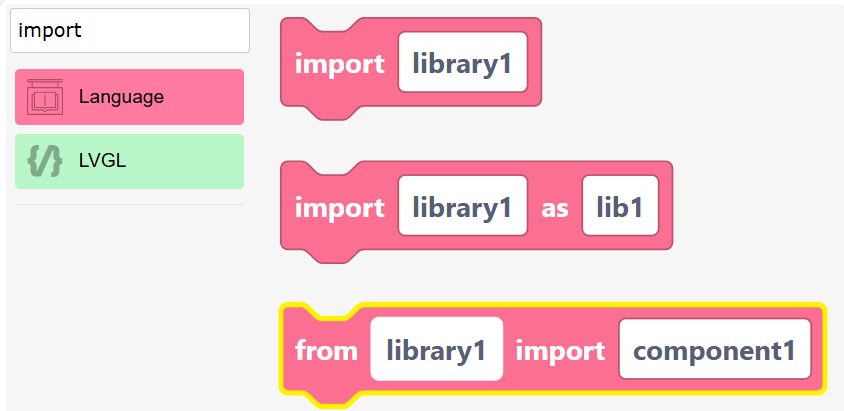
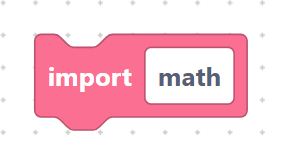
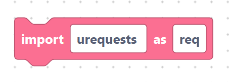
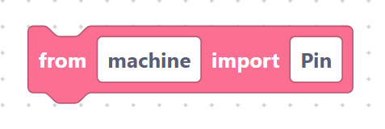
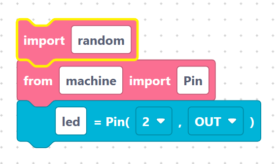

# `import` and `from … import`

Before you can use an extra module — like `math`, `random`, or a sensor driver —
you have to **import** it. SemiBlock gives you three import blocks that cover the
common patterns.

## The `importCode` block

> {width=inherit}

- **Label:** `import %1`
- **Input:** `libraryName` (default `library1`).

Generates a plain import:

```python
import math
```

> {width=inherit}

## The `importCode2` block (import with alias)

- **Label:** `import %1 as %2`
- **Inputs:** `libraryName` (default `library1`), `asName` (default `lib1`).

Generates an import with a shorter nickname:

```python
import urequests as req
```

> {width=inherit}

Now you can write `req.get(...)` instead of the full name.

## The `fromImportCode` block

- **Label:** `from %1 import %2`
- **Inputs:** `libraryName` (default `library1`), `component` (default
  `component1`).

Imports just one piece of a module:

```python
from machine import Pin
```

> {width=inherit}

## Good to know

- SemiBlock already adds many common imports for you at the top of the program
  (such as `from machine import Pin` and `import math`). Use these blocks for
  anything extra, like `import random` or `import re`.
- Put import blocks near the top of your workspace so they run first.

## Worked example

```python
import random
from machine import Pin

led = Pin(2, Pin.OUT)
```

> {width=inherit}

## Next

Continue to [`for` loops](for-loop.md)
