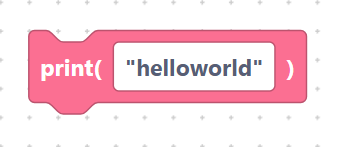
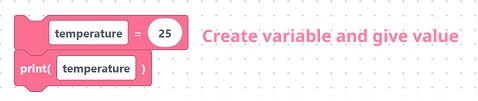
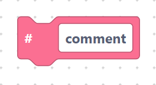
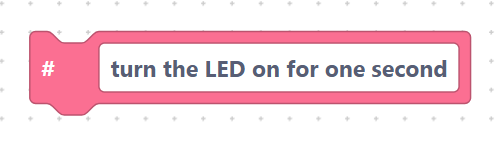
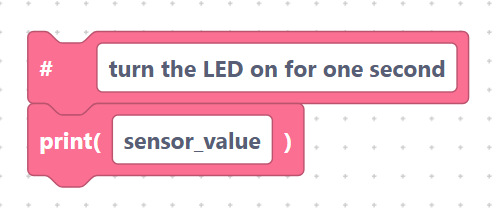

# `print` and comments

These two blocks help you **see what your program is doing** and **leave notes**
for yourself and others.

## The `print` block

> {width=inherit}

- **Label:** `print(%1)`
- **Input:** `value` — what to display (default `"helloworld"`).

The text you type goes inside the parentheses **exactly as written**, so wrap
words in quotes to print them as text:

```python
print("helloworld")
```

Print a variable by leaving out the quotes:

```python
print(temperature)
```

> {width=inherit}

Output appears in the editor's console (and on the serial monitor when running
on a real board).

## The `comment` block

> {width=inherit}

- **Label:** `# %1`
- **Input:** `comment` — your note (default `comment`).

A comment is a line MicroPython ignores. Use it to explain your code:

```python
# comment
```

For example:

```python
# turn the LED on for one second
```

> {width=inherit}

## Worked example

```python
# read and show the sensor value
print(sensor_value)
```

> {width=inherit}

The first line is a comment block (a reminder for humans); the second line is a
`print` block that actually runs.

## Next

Continue to [`pass` statement](pass.md)
