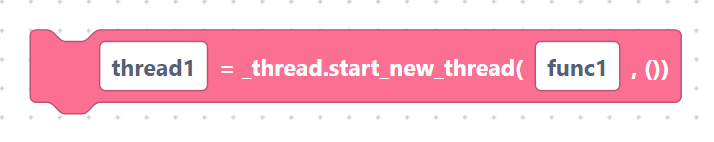
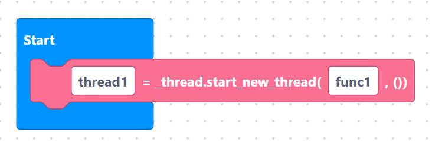
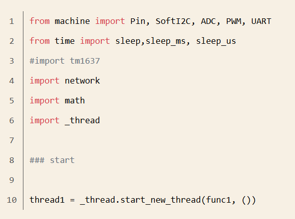
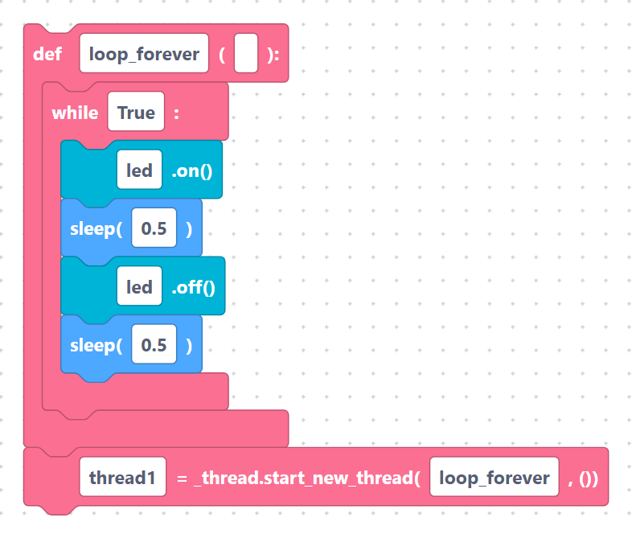

# Threads (`startThread`)

A **thread** lets part of your program run in the background while the rest keeps
going. On ESP32 this is handy for jobs like updating a display while reading a
sensor. SemiBlock uses MicroPython's built-in `_thread` module.

## The `startThread` block

> {width=inherit}

- **Label:** `%1 = _thread.start_new_thread(%2, ())`
- **Inputs:**
  - `varName` — a name to hold the thread (default `thread1`).
  - `funcName` — the name of the function to run in the background (default
    `func1`).

It generates:

```python
thread1 = _thread.start_new_thread(func1, ())
```

The `()` at the end is an empty list of arguments — the function is started with
no extra inputs.

## Required import

When your program uses a thread, SemiBlock automatically adds this near the top:

```python
import _thread
```
> {width=inherit} > {width=inherit}

You do not need a separate import block for it.

## Worked example

Define a background task with [`def`](def.md), then start it:

```python
import _thread

def loop_forever():
	while True:
		led.on()
		sleep(0.5)
		led.off()
		sleep(0.5)

thread1 = _thread.start_new_thread(loop_forever, ())
```

> {width=inherit}

The LED now blinks in the background, leaving your main program free to do other
work.

> Tip: keep thread functions simple. Two threads touching the same hardware at
> once can clash.

## Next

Continue to [Math](../math/index.md)
