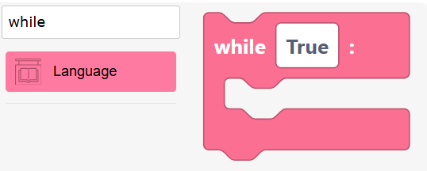
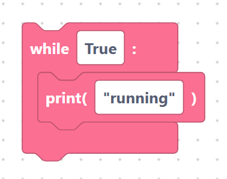
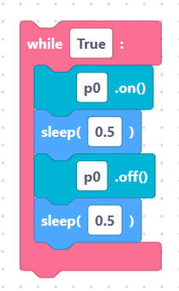

# `while` loops

A **`while` loop** keeps repeating its body for as long as a condition stays
true. Use it when you do not know in advance how many rounds you need — for
example, "keep going forever" or "wait until a button is pressed".

## The `whileLoop` block

> {width=inherit}

- **Label:** `while %1:`
- **Input:** `conditions` — the test to check each round (default `True`).
- **Body:** a stack of statement blocks that run while the test is true.

With the default condition and a `print` block inside:

```python
while True:
	print("running")
```

> {width=inherit}

Because `True` is always true, this loop runs forever — a common pattern on
microcontrollers, which usually never "finish".

## Writing conditions

The `conditions` field is plain MicroPython. Some examples:

- `True` — loop forever.
- `count < 10` — loop while `count` is below 10.
- `button.value() == 0` — loop while a button is held down.

## Worked example: forever loop

The classic microcontroller heartbeat:

```python
while True:
	led.on()
	sleep(0.5)
	led.off()
	sleep(0.5)
```

> {width=inherit}

> Tip: if you write `while True:` make sure the body contains a `sleep` so the
> board has time to breathe and stay responsive.

## Next

Continue to [`if` / `elif` / `else`](if-else.md)
