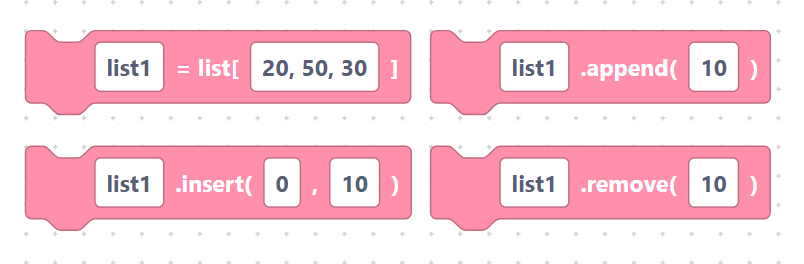
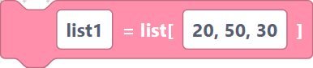
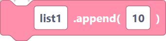
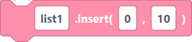
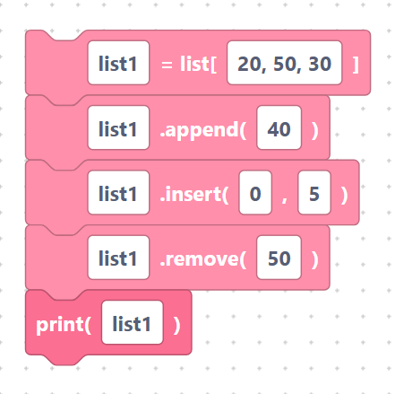

# Creating, appending, inserting, removing

> {width=inherit}

These blocks build a list and change what is inside it.

## The `createList` block

- **Label:** `%1 = list[%2]` — inputs `list_name` (default `list1`), `list`
  (default `20, 50, 30`).

Although the label shows `list[...]`, the generated code uses plain square
brackets:

```python
list1 = [20, 50, 30]
```

> {width=inherit}


Type the items separated by commas in the `list` field.

## The `appendList` block

- **Label:** `%1.append(%2)` — inputs `list_name` (default `list1`), `value`
  (default `10`). Adds an item to the **end**.

```python
list1.append(10)
```

> {width=inherit}


## The `insertList` block

- **Label:** `%1.insert(%2, %3)` — inputs `list_name` (default `list1`), `index`
  (default `0`), `value` (default `10`). Inserts an item at a position.

```python
list1.insert(0, 10)
```

> {width=inherit}

## The `removeList` block

- **Label:** `%1.remove(%2)` — inputs `list_name` (default `list1`), `index`
  (default `10`). Removes the **first matching value** (despite the field name,
  this is a value, not a position).

```python
list1.remove(10)
```

> {width=inherit}

## Worked example

```python
list1 = [20, 50, 30]
list1.append(40)
list1.insert(0, 5)
list1.remove(50)
print(list1)
```

> {width=inherit}

## Next

Continue to [`pop`, `sort`, `reverse`, `len`](manipulate.md)
