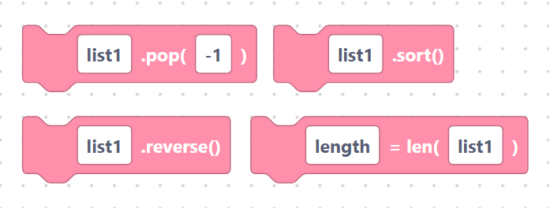
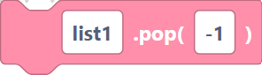
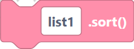
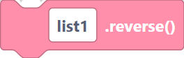
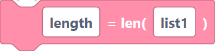
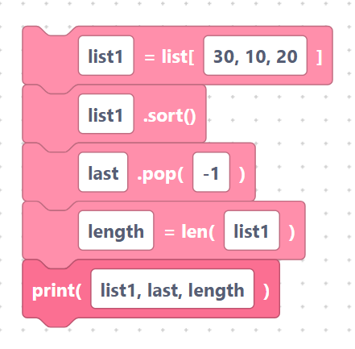

# `pop`, `sort`, `reverse`, `len`

> {width=inherit}

These blocks reorder a list, take items out, or count them.

## The `popList` block

- **Label:** `%1.pop(%2)` — inputs `list_name` (default `list1`), `index`
  (default `-1`). Removes and returns the item at a position. `-1` means the last
  item.

```python
list1.pop(-1)
```

> {width=inherit}

## The `sortList` block

- **Label:** `%1.sort()` — input `list_name` (default `list1`). Sorts the list in
  place, smallest first.

```python
list1.sort()
```

> {width=inherit}

## The `reverseList` block

- **Label:** `%1.reverse()` — input `list_name` (default `list1`). Flips the order
  of the list in place.

```python
list1.reverse()
```

> {width=inherit}

## The `lenList` block

- **Label:** `%1 = len(%2)` — inputs `var_name` (default `length`), `list_name`
  (default `list1`). Stores how many items the list has.

```python
length=len(list1)
```

> {width=inherit}

## Worked example

```python
list1 = [30, 10, 20]
list1.sort()
last = list1.pop(-1)
length=len(list1)
print(list1, last, length)
```

> {width=inherit}

## Next

Continue to [Indexing and slicing](slicing.md)
