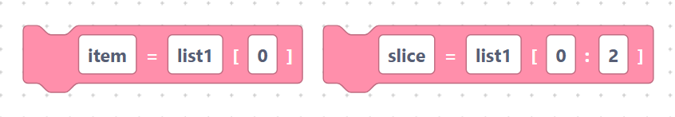
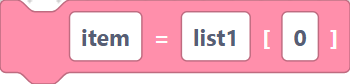
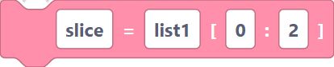
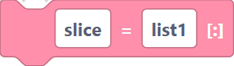
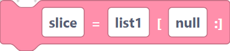
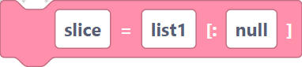
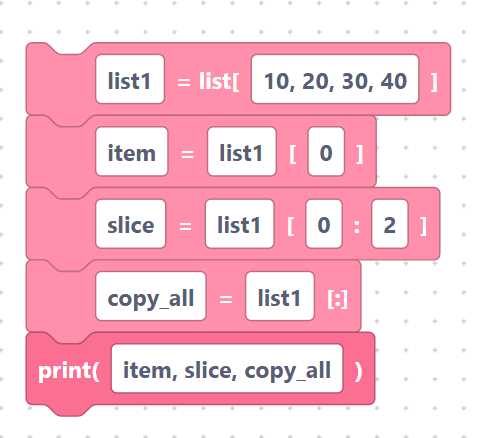

# Indexing and slicing

> {width=inherit}

**Indexing** reads a single item by its position; **slicing** copies a range of
items into a new list. Positions start at `0`.

## The `getList` block

- **Label:** `%1 = %2[%3]` — inputs `var_name` (default `item`), `list_name`
  (default `list1`), `index` (default `0`). Reads one item.

```python
item=list1[0]
```

> {width=inherit}

## The `getListSlice` block

- **Label:** `%1 = %2[%3:%4]` — inputs `var_name` (default `slice`), `list_name`
  (default `list1`), `start` (default `0`), `end` (default `2`). Copies items
  from `start` up to (but not including) `end`.

```python
slice=list1[0:2]
```

> {width=inherit}

## The `getListSlice4` block

- **Label:** `%1 = %2[:]` — inputs `var_name` (default `slice`), `list_name`
  (default `list1`). Copies the whole list.

```python
slice=list1[:]
```

> {width=inherit}

## The `getListSlice2` and `getListSlice3` blocks

These two blocks are meant to slice "from a start to the end" and "from the
beginning to an end". In the current generator their fields do not line up, so
they emit a literal `null`:

```python
slice=list1[null:]
```

> {width=inherit}

```python
slice=list1[:null]
```

> {width=inherit}

> Recommendation: until this is fixed, use the full **`getListSlice`** block
> (`[start:end]`) instead — give it the start and end you want.

## Worked example

```python
list1 = [10, 20, 30, 40]
item=list1[0]
slice=list1[0:2]
copy_all=list1[:]
print(item, slice, copy_all)
```

> {width=inherit}

## Next

Continue to [Dictionary](../dict/index.md)
