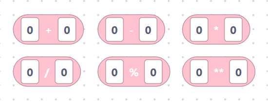
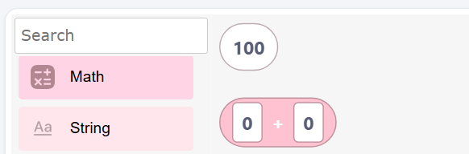
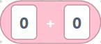
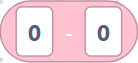
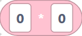
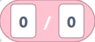
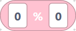
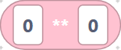
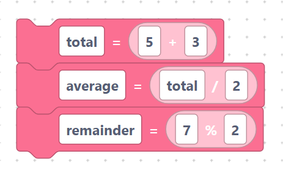

# Integers, add / subtract / multiply / divide / modulo / power

> {width=inherit}

These are the everyday arithmetic blocks. Each one is a **value block**: it
produces a number you can plug into a variable, a `print`, or another math
block.

## The `integerInit` block

- **Label:** a single number box.
- **Input:** `value` (default `100`).

Emits the number exactly as typed:

```python
100
```

> {width=inherit}

Use it as the value for a [variable](../language/variables.md) block, e.g.
`count = 100`.

## The `mathAdd` block

- **Label:** `%1 + %2` — inputs `A`, `B` (both default `0`).

```python
0 + 0
```

> {width=inherit}

## The `mathSubtract` block

- **Label:** `%1 - %2` — inputs `A`, `B`.

```python
0 - 0
```

> {width=inherit}

## The `mathMultiply` block

- **Label:** `%1 * %2` — inputs `A`, `B`.

```python
0 * 0
```

> {width=inherit}

## The `mathDivide` block

- **Label:** `%1 / %2` — inputs `A`, `B`.

```python
0 / 0
```

> {width=inherit}

## The `mathModulo` block

- **Label:** `%1 % %2` — inputs `A`, `B`. Gives the **remainder** of a division.

```python
0 % 0
```

> {width=inherit}

## The `mathPower` block

- **Label:** `%1 ** %2` — inputs `A`, `B`. Raises `A` to the power of `B`.

```python
0 ** 0
```

> {width=inherit}

## Worked example

```python
total = 5 + 3
average = total / 2
remainder = 7 % 2
```

> {width=inherit}

> Tip: the fields accept whole numbers, decimals, or variable names — whatever
> you type is inserted into the code verbatim.

## Next

Continue to [`sqrt`, `sin`, `cos`, `tan`, `log`, `exp`](functions.md)
