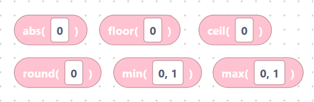
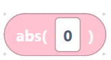
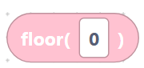
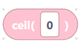
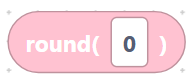
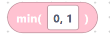
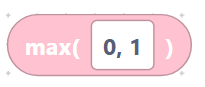
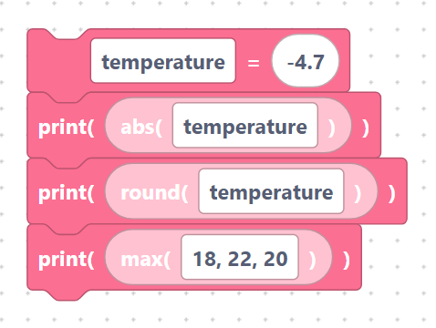

# `abs`, `floor`, `ceil`, `round`, `min`, `max`

> {width=inherit}

These blocks tidy numbers up: remove a sign, round to whole numbers, or pick the
smallest/largest of several values. Each is a **value block**.

`floor` and `ceil` come from the `math` module (already imported for you);
`abs`, `round`, `min`, and `max` are built in.

## The `mathAbs` block

- **Label:** `abs(%1)` — input `A` (default `0`). Absolute (always positive) value.

```python
abs(0)
```

> {width=inherit}

## The `mathFloor` block

- **Label:** `floor(%1)` — input `A`. Rounds **down** to a whole number.

```python
math.floor(0)
```

> {width=inherit}

## The `mathCeil` block

- **Label:** `ceil(%1)` — input `A`. Rounds **up** to a whole number.

```python
math.ceil(0)
```

> {width=inherit}

## The `mathRound` block

- **Label:** `round(%1)` — input `A`. Rounds to the nearest whole number.

```python
round(0)
```

> {width=inherit}

## The `mathMin` block

- **Label:** `min(%1)` — input `VALUES` (default `0, 1`). Smallest of the values.

```python
min(0, 1)
```

> {width=inherit}

## The `mathMax` block

- **Label:** `max(%1)` — input `VALUES` (default `0, 1`). Largest of the values.

```python
max(0, 1)
```

> {width=inherit}

## Worked example

```python
temperature = -4.7
print(abs(temperature))
print(round(temperature))
print(max(18, 22, 20))
```

> {width=inherit}

> Tip: for `min` and `max`, type the values separated by commas inside the one
> field — they are inserted into the parentheses exactly as written.

## Next

Continue to [Constants: `pi`, `e`](constants.md)
