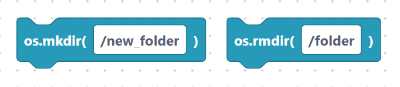
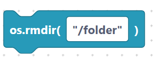
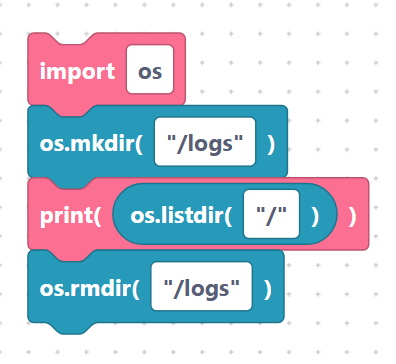

# Making and removing directories

> {width=inherit}

These blocks create and delete folders. Each needs an
[`import os`](../language/imports.md) block, and path fields are inserted
**verbatim** — quote them.

## The `osMkdir` block

- **Label:** `os.mkdir(%1)` — input `path` (default `/new_folder`). Makes a new
  folder.

```python
os.mkdir(/new_folder)
```

> {width=inherit}

With a quoted path:

```python
os.mkdir("/new_folder")
```

> {width=inherit}

## The `osRmdir` block

- **Label:** `os.rmdir(%1)` — input `path` (default `/folder`). Removes an
  **empty** folder.

```python
os.rmdir(/folder)
```

> {width=inherit}

With a quoted path:

```python
os.rmdir("/folder")
```

> {width=inherit}

## Worked example

```python
import os

os.mkdir("/logs")
print(os.listdir("/"))
os.rmdir("/logs")
```

> {width=inherit}

> Tip: `os.rmdir` only works on empty folders. Remove the files inside first
> with [`os.remove`](files.md).

## Next

Continue to [`getcwd`, `chdir`, `stat`, `uname`](info.md)
