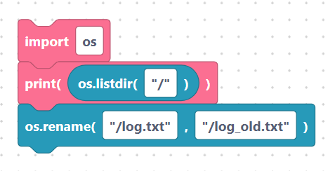

# Listing, removing, renaming files

> {width=inherit}

These blocks manage individual files on the device. Each needs an
[`import os`](../language/imports.md) block, and path fields are inserted
**verbatim** — quote them.

## The `osListDir` block

- **Label:** `os.listdir(%1)` — input `path` (default `/`). Lists the names in a
  folder.

```python
os.listdir(/)
```

> {width=inherit}

With a quoted path:

```python
os.listdir("/")
```

> {width=inherit}

## The `osRemove` block

- **Label:** `os.remove(%1)` — input `path` (default `/file.txt`). Deletes a file.

```python
os.remove(/file.txt)
```

> {width=inherit}

With a quoted path:

```python
os.remove("/file.txt")
```

> {width=inherit}

## The `osRename` block

- **Label:** `os.rename(%1, %2)` — inputs `oldPath` (default `/old.txt`),
  `newPath` (default `/new.txt`). Renames or moves a file.

```python
os.rename(/old.txt, /new.txt)
```

> {width=inherit}

With quoted paths:

```python
os.rename("/old.txt", "/new.txt")
```

> {width=inherit}

## Worked example

```python
import os

print(os.listdir("/"))
os.rename("/log.txt", "/log_old.txt")
```

> {width=inherit}

## Next

Continue to [Making and removing directories](dirs.md)
