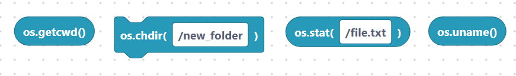
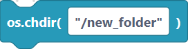
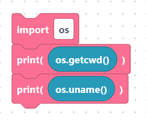

# `getcwd`, `chdir`, `stat`, `uname`

> {width=inherit}

These blocks report or change where you are in the file system and give
information about files and the device. Each needs an
[`import os`](../language/imports.md) block.

## The `osGetcwd` block

- **Label:** `os.getcwd()` — no inputs. Returns the current working directory.

```python
os.getcwd()
```

> {width=inherit}

## The `osChdir` block

- **Label:** `os.chdir(%1)` — input `path` (default `/new_folder`). Changes the
  current directory. Quote the path.

```python
os.chdir(/new_folder)
```

> {width=inherit}

With a quoted path:

```python
os.chdir("/new_folder")
```

> {width=inherit}

## The `osStat` block

- **Label:** `os.stat(%1)` — input `path` (default `/file.txt`). Returns details
  about a file, such as its size.

```python
os.stat(/file.txt)
```

> {width=inherit}

With a quoted path:

```python
os.stat("/file.txt")
```

> {width=inherit}

## The `osUname` block

- **Label:** `os.uname()` — no inputs. Returns information about the MicroPython
  system and board.

```python
os.uname()
```

> {width=inherit}

## Worked example

```python
import os

print(os.getcwd())
print(os.uname())
```

> {width=inherit}

## Next

Continue to [`sync`, `system`, `urandom`](misc.md)
