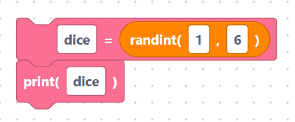

# Random

> {width=inherit}

The **Random** category produces unpredictable values — perfect for games, dice,
random colours, or shuffling a deck. The blocks use MicroPython's `random`
module.

Add an [`import random`](../language/imports.md) block to your program so these
blocks work. Each one is a **value block**.

## What you will learn

- [`random`, `randint`, `randrange`, `uniform`](numbers.md)
- [`choice`, `shuffle`, `sample`](sequence.md)

## A quick taste

```python
import random

dice = random.randint(1, 6)
print(dice)
```

> {width=inherit}

## Next

Continue to [`random`, `randint`, `randrange`, `uniform`](numbers.md)
