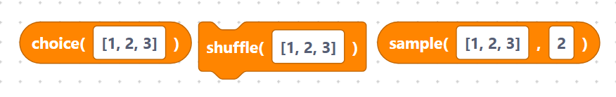
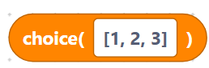
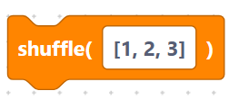
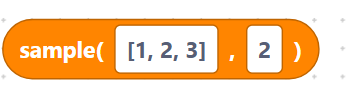
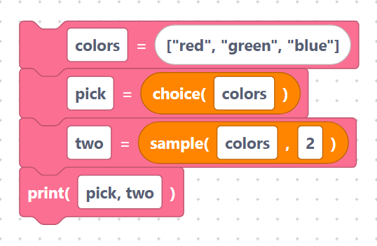

# `choice`, `shuffle`, `sample`

> {width=inherit}

These blocks work with lists: pick a random item, shuffle the order, or grab a
random handful. Each needs an [`import random`](../language/imports.md) block.

The list field is inserted **verbatim**, so type a real list such as
`[1, 2, 3]`.

## The `choice` block

- **Label:** `choice(%1)` — input `list` (default `[1, 2, 3]`). Returns one
  random item from the list. This is a **value block**.

```python
random.choice([1, 2, 3])
```

> {width=inherit}

## The `shuffle` block

- **Label:** `shuffle(%1)` — input `list` (default `[1, 2, 3]`). Rearranges the
  list in place into a random order.

```python
random.shuffle([1, 2, 3])
```

> {width=inherit}

## The `sample` block

- **Label:** `sample(%1, %2)` — inputs `list` (default `[1, 2, 3]`), `k`
  (default `2`). Returns a new list of `k` random items. This is a **value block**.

```python
random.sample([1, 2, 3], 2)
```

> {width=inherit}

## Worked example

```python
import random

colors = ["red", "green", "blue"]
pick = random.choice(colors)
two = random.sample(colors, 2)
print(pick, two)
```

> {width=inherit}

> Tip: `choice` and `sample` give you results to use, while `shuffle` changes the
> original list in place.

## Next

Continue to [Exception Handling](../exception/index.md)
