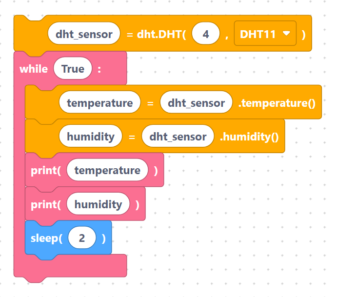

# DHT11 / DHT22 (Temperature & Humidity)

The **DHT** family are cheap digital sensors that report both **temperature** and **relative
humidity** over a single data wire. The **DHT11** is the budget version (±2 °C, whole-percent
humidity); the **DHT22** is more accurate and has a wider range. SemiBlock supports both — you
pick the model from a dropdown.

## How to wire it

A DHT module usually has three pins:

| Sensor pin | Connect to | Notes |
|------------|-----------|-------|
| `VCC` / `+` | `3V3` | DHT11/DHT22 run happily at 3.3 V |
| `DATA` / `OUT` | a GPIO (default **GPIO 4**) | bare sensors need a 10 kΩ pull-up to VCC; most modules include it |
| `GND` / `−` | `GND` | shared ground |

## The blocks

- **`dhtInit`** — create the sensor object on a pin and choose **DHT11** or **DHT22**.
- **`dhtReadTemperature`** — take a fresh measurement and store the temperature (°C).
- **`dhtReadHumidity`** — take a fresh measurement and store the humidity (%).

### Initialize the sensor

With the default fields (`dht_sensor`, pin `4`, model `DHT11`) this block generates:

```python
dht_sensor = dht.DHT11(Pin(4))
```

> {width=inherit}

Choosing **DHT22** in the dropdown changes it to `dht.DHT22(Pin(4))`. The `import dht` line is
added automatically at the top of your program.

### Read temperature

`dhtReadTemperature` (variable `temperature`, sensor `dht_sensor`) generates **two** lines — it
re-measures first, then reads the cached value:

```python
dht_sensor.measure()
temperature = dht_sensor.temperature()
```

> {width=inherit}

### Read humidity

`dhtReadHumidity` (variable `humidity`, sensor `dht_sensor`) works the same way:

```python
dht_sensor.measure()
humidity = dht_sensor.humidity()
```

> {width=inherit}

> **Tip:** `measure()` talks to the sensor and refreshes both readings. The DHT11 should not be
> polled faster than about once per second (the DHT22 about once every two seconds), so leave a
> short delay between reads.

## Complete example — read every 2 seconds and print

```python
dht_sensor = dht.DHT11(Pin(4))

while True:
    dht_sensor.measure()
    temperature = dht_sensor.temperature()
    dht_sensor.measure()
    humidity = dht_sensor.humidity()
    print(temperature)
    print(humidity)
    sleep(2)
```

> {width=inherit}

Each loop refreshes the sensor, prints the temperature in °C and the humidity in %, then waits
two seconds before reading again.

## Next

Measure distance with the [HC-SR04 Ultrasonic Distance Sensor](hc-sr04.md).
