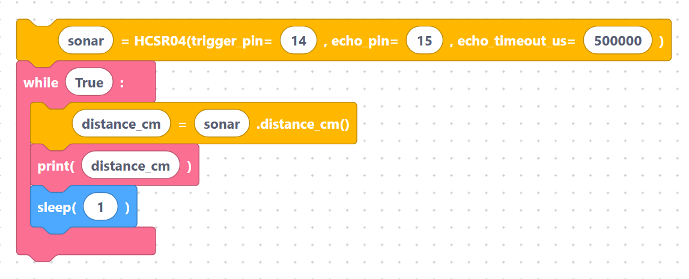

# HC-SR04 Ultrasonic Distance Sensor

The **HC-SR04** measures distance by sending an ultrasonic *ping* and timing the echo that
bounces back off an object. It is great for obstacle detection, parking helpers, and robot
navigation. It reliably reads from roughly **2 cm to 4 m**.

## How to wire it

The HC-SR04 has four pins:

| Sensor pin | Connect to | Notes |
|------------|-----------|-------|
| `VCC` | `5V` | the module needs 5 V to fire the transducer |
| `Trig` | a GPIO (default **GPIO 14**) | the board pulses this to start a measurement |
| `Echo` | a GPIO (default **GPIO 15**) | goes high for the round-trip time |
| `GND` | `GND` | shared ground |

> **3.3 V boards:** the `Echo` line idles at 5 V, but ESP32 GPIOs are 3.3 V. For long-term use add
> a simple resistor divider (or a level shifter) on `Echo`. See
> [Powering sensors safely](../hardware/power.md).

## The blocks

- **`hcsr04Init`** — set up the sensor with a trigger pin, echo pin, and echo timeout (µs).

> {width=inherit}

- **`hcsr04DistanceCm`** — read the distance in centimetres.

> {width=inherit}

- **`hcsr04DistanceMm`** — read the distance in millimetres.

> {width=inherit}

### Initialize the sensor

The init block emits a small **`HCSR04` driver class** (the trigger/echo pulse timing) and then
creates the object. With the default fields (`sonar`, trigger `14`, echo `15`, timeout `500000`):

```python
import machine
from machine import Pin
from utime import sleep_us

class HCSR04:
    def __init__(self, trigger_pin, echo_pin, echo_timeout_us=500*2*30):
        self.echo_timeout_us = echo_timeout_us
        self.trigger = Pin(trigger_pin, mode=Pin.OUT, pull=None)
        self.trigger.value(0)
        self.echo = Pin(echo_pin, mode=Pin.IN, pull=None)
    def _send_pulse_and_wait(self):
        self.trigger.value(0)
        sleep_us(5)
        self.trigger.value(1)
        sleep_us(10)
        self.trigger.value(0)
        try:
            pulse_time = machine.time_pulse_us(self.echo, 1, self.echo_timeout_us)
            if pulse_time < 0:
                pulse_time = int(500 * 29.1)
            return pulse_time
        except OSError as ex:
            if ex.args[0] == 110:
                raise OSError("Out of range")
            raise ex
    def distance_mm(self):
        pulse_time = self._send_pulse_and_wait()
        return pulse_time * 100 // 582
    def distance_cm(self):
        pulse_time = self._send_pulse_and_wait()
        return (pulse_time / 2) / 29.1

sonar = HCSR04(trigger_pin=14, echo_pin=15, echo_timeout_us=500000)
```

The `echo_timeout_us` is how long (in microseconds) to wait for the echo before giving up — at
500000 µs that is the practical maximum range.

### Read distance in centimetres

`hcsr04DistanceCm` (variable `distance_cm`, sensor `sonar`) generates:

```python
distance_cm = sonar.distance_cm()
```

### Read distance in millimetres

`hcsr04DistanceMm` (variable `distance_mm`, sensor `sonar`) generates:

```python
distance_mm = sonar.distance_mm()
```

## Complete example — print distance every second

```python
sonar = HCSR04(trigger_pin=14, echo_pin=15, echo_timeout_us=500000)

while True:
    distance_cm = sonar.distance_cm()
    print(distance_cm)
    sleep(1)
```

> {width=inherit}

(The full `HCSR04` class shown above is generated once by the init block; only the loop is shown
here for clarity.) Each second the program fires a ping and prints the measured distance in
centimetres.

## Next

Read an analog thermistor with the [Temperature sensor block](temperature.md).
