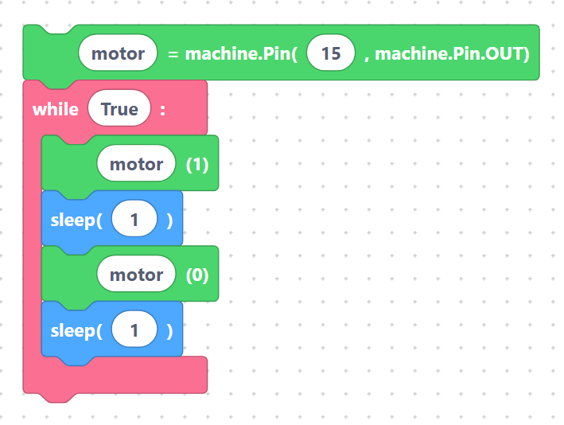

# DC Motor (on / off / control)

A small **DC motor** spins when current flows through it. Because a motor draws more current than
a GPIO pin can safely supply, you drive it through a **transistor or motor driver** (such as an
L298N or a single NPN transistor). SemiBlock controls that driver's input pin as a simple digital
output: high = on, low = off.

## How to wire it

Never connect a motor directly to a GPIO. Use a driver/transistor:

| Connection | Goes to | Notes |
|------------|---------|-------|
| Driver **input / signal** | a GPIO (default **GPIO 15**) | the pin SemiBlock toggles |
| Driver **motor power** | external supply (e.g. 5–6 V battery) | motors are noisy — keep them off the 3.3 V rail |
| Motor `+` / `−` | driver motor outputs | direction depends on wiring |
| `GND` | shared `GND` | board, driver, and battery must share ground |

## The blocks

- **`motor`** — create the control pin as a digital output.
- **`motorOn`** — drive the pin high (motor runs).
- **`motorOff`** — drive the pin low (motor stops).

### Create the motor pin

With the default fields (variable `motor`, pin `15`) the block generates:

```python
motor = machine.Pin(15, machine.Pin.OUT)
```

> {width=inherit}

### Turn the motor on

`motorOn` (variable `motor`) generates:

```python
motor (1)
```

> {width=inherit}

### Turn the motor off

`motorOff` (variable `motor`) generates:

```python
motor (0)
```

> {width=inherit}

> **How it works:** the variable holds a `Pin` object, and calling it like `motor(1)` /
> `motor(0)` sets the pin high or low — the MicroPython shorthand for `motor.value(1)` /
> `motor.value(0)`. Make sure the variable name matches the one you used in the *create* block.

## Complete example — run for 2 seconds, then stop

```python
motor = machine.Pin(15, machine.Pin.OUT)

while True:
    motor (1)
    sleep(2)
    motor (0)
    sleep(2)
```

> {width=inherit}

The motor runs for two seconds, stops for two seconds, and repeats.

## Next

Set a precise angle with the [Servo block](servo.md).
