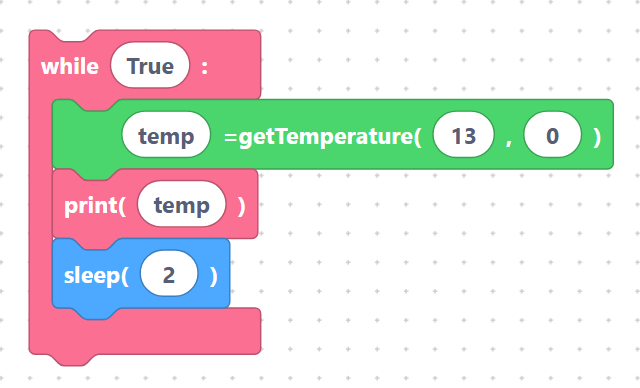

# Temperature sensor block

The **Temperature** block reads an **analog thermistor** — a resistor whose value changes with
temperature — through the ESP32's ADC (analog-to-digital converter). Unlike the digital DHT
sensors, this block measures a voltage and converts it to °C using a built-in helper function.

## How to wire it

A typical thermistor module has a digital pin and an analog pin:

| Module pin | Connect to | Notes |
|------------|-----------|-------|
| `VCC` / `+` | `3V3` | power |
| `A0` / `AO` | an ADC-capable GPIO (default **ADC 0**) | the analog voltage to read |
| `D0` / `DO` | a GPIO (default **GPIO 13**) | digital threshold output |
| `GND` / `−` | `GND` | shared ground |

## The block

- **`temperature`** — read the thermistor and store a temperature value in °C.

With the default fields (variable `temp`, D0 pin `13`, ADC channel `0`) the block generates:

```python
temp=getTemperature(13, 0)
```

> {width=inherit}

`getTemperature(D0, adc_pin)` is a helper that SemiBlock adds to the top of your program
automatically whenever a Temperature block is used. It reads the raw ADC value, converts it to a
voltage, applies the thermistor (Steinhart–Hart style) formula, and returns degrees Celsius — or
`-1` if the read fails:

```python
def getTemperature(D0, adc_pin):
    try:
        temp_DO = Pin(D0, Pin.IN)       # temperature sensor DO port as input
        temp_ADC = ADC(adc_pin)         # ADC channel
        analogVal = temp_ADC.read_u16() # read the analog value
        Vr = 3.3 * float(analogVal) / 65535
        Rt = 10000 * Vr / (3.3 - Vr)
        temp = 1 / (((math.log(Rt / 10000)) / 3950) + (1 / (273.15 + 25)))
        temp = temp - 273.15
        return temp
    except:
        return -1
```

> **Note:** the value passed for `ADC` is the analog channel number, and `D0` is the digital pin
> of the module. You normally only need to change them if you wire the sensor to different pins.

## Complete example — print temperature every 2 seconds

```python
while True:
    temp=getTemperature(13, 0)
    print(temp)
    sleep(2)
```

> {width=inherit}

(The `getTemperature` helper above is generated automatically; only the loop is shown here.) Every
two seconds the program reads the thermistor and prints the temperature in °C.

## Next

Show numbers on a [4-Digit 7-Segment Display](four-digit.md).
