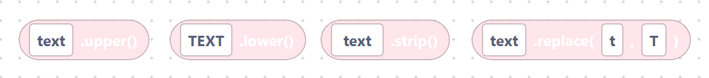
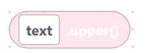
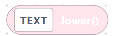
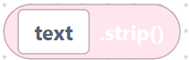
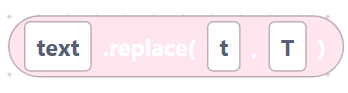
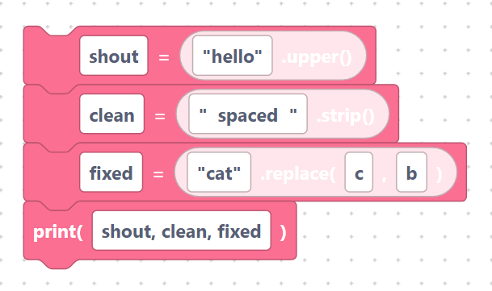

# `upper`, `lower`, `strip`, `replace`

> {width=inherit}

These blocks change the look of a string: switch case, trim spaces, or swap text.
Each is a **value block** that returns a new string.

Remember that text fields are inserted **verbatim**, so type quotes around any
literal text.

## The `stringUpper` block

- **Label:** `%1.upper()` — input `value` (default `text`). Makes everything UPPERCASE.

```python
text.upper()
```

> {width=inherit}

## The `stringLower` block

- **Label:** `%1.lower()` — input `value` (default `TEXT`). Makes everything lowercase.

```python
TEXT.lower()
```

> {width=inherit}

## The `stringStrip` block

- **Label:** `%1.strip()` — input `value` (default ` text `). Removes spaces from
  both ends.

```python
 text .strip()
```

> {width=inherit}

## The `stringReplace` block

- **Label:** `%1.replace(%2, %3)` — inputs `value` (default `text`), `old`
  (default `t`), `new` (default `T`). Swaps every `old` for `new`.

```python
text.replace(t, T)
```

> {width=inherit}

## Worked example

With quotes typed into the fields so they are real text:

```python
shout = "hello".upper()
clean = "  spaced  ".strip()
fixed = "cat".replace("c", "b")
print(shout, clean, fixed)
```

> {width=inherit}

## Next

Continue to [`find`, `split`, `join`](search.md)
